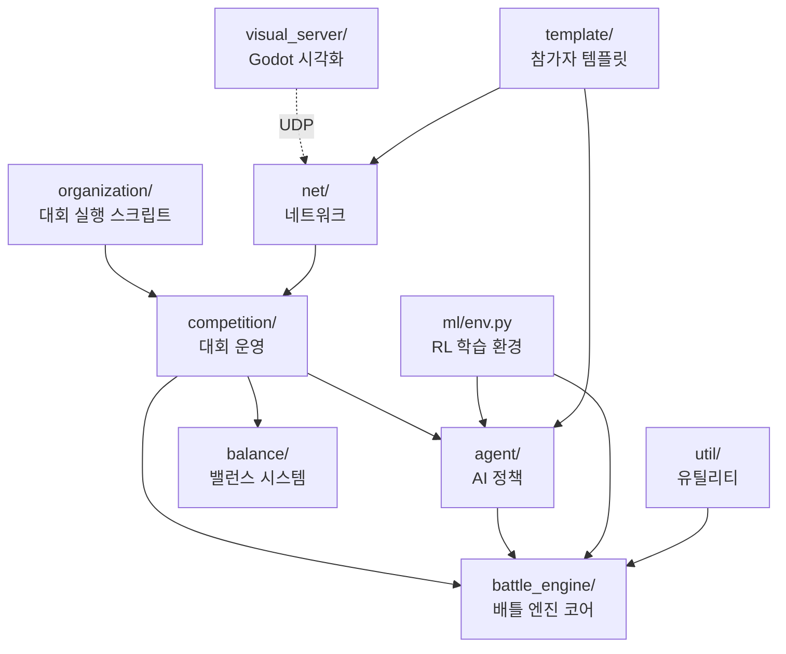

# VGC AI Framework 2 — 프로젝트 구조 분석 보고서

> **프로젝트**: `pokemon-vgc-engine` (VGC AI Framework 2 v2.1.1)
> **목적**: 포켓몬 VGC(Video Game Championships)를 AI 에이전트로 시뮬레이션하는 프레임워크
> **라이선스**: MIT | **작성자**: Simão Reis
> **분석 제외**: `edition/vgc2025` (로그 및 작년 출품 코드)

---

## 1. 루트 디렉토리 파일

| 파일 | 역할 |
|------|------|
| `README.md` | 프로젝트 소개, 설치 방법, 디렉토리 구조 설명, 인용 정보 |
| `setup.py` | pip 패키지 설치 설정 (`pip install .`). 의존성: gymnasium, numpy, setuptools |
| `requirements.txt` | pip 의존성 목록 (UTF-16LE 인코딩) |
| `CHANGELOG` | 버전별 변경 내역 |
| `LICENSE.txt` | MIT 라이선스 전문 |

---

## 2. `vgc2/` — 핵심 프레임워크 모듈

프레임워크의 **모든 핵심 로직**이 담긴 Python 패키지.

### 2.1 `vgc2/battle_engine/` — 배틀 엔진 (핵심)

포켓몬 배틀의 **게임 로직 전체**를 구현한 서브패키지.

| 파일 | 역할 |
|------|------|
| `__init__.py` | **`BattleEngine` 클래스** — 배틀 전체 흐름 관리. 턴 실행(`run_turn`), 기술 수행, 교체, 상태이상 처리, 턴 종료 효과 등을 총괄. 이벤트 큐를 통한 렌더링 지원. STRUGGLE 기술 정의 |
| `constants.py` | **`BattleRuleParam` 클래스** — 배틀 규칙 파라미터 전체 정의. 타입 상성표(19×19), 랭크 보정 배율, 명중률 배율, 날씨/필드/리플렉트 턴 수, STAB 배율, 화상·독·모래 데미지 비율 등. 성격(Nature)별 스탯 보정 매핑(`NATURES` dict) |
| `modifiers.py` | **Enum 정의 모음** — `Type`(18종+무타입), `Category`(물리/특수/변화), `Stat`(HP~명중), `Status`(수면/화상/얼음/마비/독/맹독), `Weather`(4종), `Terrain`(4종), `Hazard`(스텔스록/독압정), `Nature`(25종). `Stats`/`MutableStats` 타입 앨리어스 |
| `pokemon.py` | **포켓몬 데이터 모델** — `PokemonSpecies`(종족값, 타입, 기술풀), `Pokemon`(개체: 종족+EV/IV/성격→실스탯 계산), `BattlingPokemon`(배틀 중 상태: HP, 부스트, 상태이상, PP 관리, 데미지/회복 처리, 쓰러짐 콜백) |
| `move.py` | **기술(Move) 데이터 모델** — `Move`(타입, 위력, 명중률, PP, 분류, 우선도, 효과 확률, 강제교체, 방어, 랭크업/다운, 회복, 반동, 날씨/필드/트릭룸/벽/위험물/상태이상/사슬묶기 등 27개 속성), `BattlingMove`(잔여 PP, 봉인 상태) |
| `damage_calculator.py` | **데미지 계산기** — 포켓몬 공식 데미지 포뮬러 구현. 부스트 스탯 계산, 타입 상성, 날씨, STAB, 화상, 필드, 리플렉트/빛의장막 보정. 독/화상/모래 DOT 데미지, 스텔스록 데미지 계산 함수 |
| `priority_calculator.py` | **행동 순서 계산** — 기술 우선도 × 1000 + (마비 보정 × 트릭룸 보정 × 부스트 스피드)로 선공 결정 |
| `threshold_calculator.py` | **임계값 계산** — 명중/회피 랭크 보정 적용 명중 확률, 방어 연속 사용 감소율, 해동/마비 체크 임계값 |
| `game_state.py` | **게임 상태 관리** — `SideConditions`(리플렉트/빛의장막/순풍/스텔스록/독압정 + 턴 카운트), `Side`(팀+사이드 조건), `State`(양 사이드 + 날씨/필드/트릭룸 + 턴 카운트). 종료 판정(`terminal`) |
| `team.py` | **팀 구조** — `Team`(Pokemon 리스트), `BattlingTeam`(액티브+리저브, 교체 로직, 쓰러짐 판정, 타이브레이커) |
| `view.py` | **정보 은닉 뷰 시스템** — `PokemonView`, `BattlingPokemonView`, `TeamView`, `BattlingTeamView`, `SideView`, `StateView`. 상대 기술/리저브를 숨기는 불완전 정보 처리. 기술 사용 시 점진적 공개 |
| `security.py` | **입력 검증(Sanitizer)** — 에이전트의 팀 선택/팀빌드 결과를 검증·보정. EV 총합 510 제한, IV 31 제한, 기술 수 제한, 중복 제거 |
| `render.py` | **이벤트 렌더링** — `EventQueue`와 이벤트 클래스들(`Battle`, `Turn`, `Attack`, `Damage`, `Heal`, `Switch`, `Faint`, `Message`, `TypeChange`, `End`). 각 이벤트를 JSON으로 직렬화하여 시각화 서버에 전송 |

### 2.2 `vgc2/agent/` — AI 에이전트 정책

| 파일 | 역할 |
|------|------|
| `__init__.py` | **추상 정책 인터페이스** 정의 — `BattlePolicy`(배틀 중 행동 결정), `SelectionPolicy`(팀 선택), `TeamBuildPolicy`(팀 빌드), `MetaBalancePolicy`(메타 밸런스), `RuleBalancePolicy`(규칙 밸런스). 커맨드 타입 앨리어스들 |
| `battle.py` | **배틀 정책 구현체 4종** — ① `RandomBattlePolicy`(랜덤 행동), ② `GreedyBattlePolicy`(1턴 탐욕 최대 데미지, 싱글/더블 지원), ③ `TreeSearchBattlePolicy`(다턴 탐색, 명중률 분기, 상대 Greedy 가정, 상대 정보 추론), ④ `TerminalBattle`(터미널 UI로 사람이 직접 조작) |
| `selection.py` | **팀 선택 정책 3종** — `BasicSelectionPolicy`(순서대로), `RandomSelectionPolicy`(랜덤), `TerminalSelection`(터미널 UI) |
| `teambuild.py` | **팀빌드 정책 2종** — `RandomTeamBuildPolicy`(랜덤 EV/성격/기술), `TerminalTeamBuild`(터미널 UI로 직접 빌드) |
| `meta_balance.py` | (비어있음 — 미구현 placeholder) |
| `rule_balance.py` | (비어있음 — 미구현 placeholder) |

### 2.3 `vgc2/balance/` — 밸런스 시스템

게임 메타·규칙의 균형을 평가하고 제약하는 서브패키지.

| 경로 | 역할 |
|------|------|
| `meta/__init__.py` | **메타 데이터 관리** — `MoveSet`/`Roster` 타입, `Meta` ABC(기술풀/로스터/매치 기록 관리), `BasicMeta`(승률/ELO/팀 사용 통계 추적) |
| `meta/constraints.py` | `MetaConstraints` — 메타 밸런스 제약 조건 (placeholder) |
| `meta/evaluator.py` | `MetaEvaluator` — 메타 균형도 평가 함수 (e.g. 종 다양성, 승률 편차) |
| `rules/__init__.py` | (빈 init) |
| `rules/constraints.py` | `RuleConstraints` — 규칙 밸런스 제약 조건 (placeholder) |
| `rules/evaluator.py` | `RuleEvaluator` — 규칙 균형도 평가 함수 (e.g. 승패 균형, 기술 다양성) |

### 2.4 `vgc2/competition/` — 대회 운영 시스템

| 파일 | 역할 |
|------|------|
| `__init__.py` | **대회 참가자 추상 클래스** — `Competitor`(배틀+선택+팀빌드 정책 보유), `CompetitorManager`(팀/ELO 관리), `DesignCompetitor`(메타/규칙 밸런스 정책), `DesignCompetitorManager` |
| `match.py` | **매치 실행** — `Match` 클래스: 두 참가자 간 Bo-N 매치 진행. 팀 선택→배틀 상태 초기화→뷰 생성→`run_battle` 실행. 랜덤 팀/고정 팀 모드 |
| `tournament.py` | **토너먼트 시스템** — `MatchHandler`(재귀적 대진표 구성), `TreeTournament`(싱글 엘리미네이션 토너먼트, 랜덤/로스터 기반 팀) |
| `ecosystem.py` | **챔피언십 & 디자인 대회** — `Championship`(라운드 로빈 리그, ELO 기반/랜덤 페어링, 에폭 단위 팀 리빌드), `MetaDesign`(메타 밸런스 트랙 실행), `RuleDesign`(규칙 밸런스 트랙 실행) |
| `elo.py` | **ELO 레이팅 계산** — 표준 ELO 공식 (K=30) |
| `fixed_matches.py` | **고정 매치 세트** — 규칙 밸런스 평가용. 고정된 팀 쌍에 대해 배틀을 실행하고 행동 롤아웃을 수집 |
| `score.py` | **시간 기반 점수 함수** — 로그 스케일로 정규화한 실행 시간 점수 (빠를수록 고득점) |

### 2.5 `vgc2/ml/` — 머신러닝 환경

| 파일 | 역할 |
|------|------|
| `env.py` | **Gymnasium 환경** — `BattleEnv` 클래스: OpenAI Gymnasium 호환 배틀 환경. 관측 공간(상태 인코딩), 행동 공간(기술 선택+타겟), 상대 정책 설정, 매 에피소드 랜덤 팀 생성. RL 학습용 |
| `aec.py` | (12바이트 — 미구현 placeholder, PettingZoo AEC 환경 예정) |

### 2.6 `vgc2/net/` — 네트워크 통신

| 파일 | 역할 |
|------|------|
| `client.py` | **프록시 클라이언트** — `ProxyCompetitor`/`ProxyDesignCompetitor`: 원격 에이전트를 로컬 인터페이스처럼 사용. `multiprocessing.connection`으로 RPC 호출 |
| `server.py` | **원격 서버** — `RemoteCompetitorManager`/`RemoteDesignCompetitorManager`: 로컬 에이전트를 네트워크에 노출. 메시지 수신→메서드 호출→결과 반환 루프 |
| `stream.py` | **이벤트 스트리밍** — `GodotClient`(UDP로 Godot에 전송), `FileClient`(`.battle` 파일로 기록), `FileAndGodotClient`(둘 다), `FilePlayer`(기록된 `.battle` 파일 재생). `CLIENT_MAP` 딕셔너리 |

### 2.7 `vgc2/util/` — 유틸리티

| 파일 | 역할 |
|------|------|
| `encoding.py` | **상태→벡터 인코딩** — 게임 상태(Move, Pokemon, Team, Side, State)를 정규화된 float 배열로 변환. `EncodeContext`로 정규화 상수 관리. ML 관측값 생성에 사용 |
| `decoding.py` | **벡터→상태 디코딩** — 인코딩의 역연산. float 배열에서 Move/Pokemon/Team/State 객체 복원. 실스탯→종족값 역계산 포함 |
| `generator.py` | **랜덤 생성기** — `gen_move`(랜덤 기술), `gen_move_set`, `gen_pkm_species`(랜덤 종), `gen_pkm`(랜덤 개체), `gen_team`(랜덤 팀), `gen_rule_set`(랜덤 규칙 변형). 정규분포 기반 합리적 랜덤 |
| `forward.py` | **상태 복사 & 시뮬레이션** — `copy_state`(깊은 복사), `forward`(복사된 상태에서 1턴 시뮬레이션). TreeSearch 정책에서 사용 |
| `rng.py` | **결정론적 RNG** — `DeterministicGenerator`: 항상 고정값 반환. `ZERO_RNG`(항상 0=항상 명중), `ONE_RNG`(항상 1=항상 빗나감). 탐색에서 확정 시나리오 시뮬레이션용 |
| `log.py` | **부스트 메시지 포매터** — 랭크 변동을 "Attack sharply increased!" 같은 문자열로 변환 |
| `param.py` | **파라미터 직렬화** — numpy 배열로부터 `BattleRuleParam`의 모든 속성(턴 수, 보정치, 타입 상성표)을 일괄 설정 |

### 2.8 `vgc2/ux/`

| 파일 | 역할 |
|------|------|
| `__init__.py` | (빈 패키지 — UI/UX 관련 미구현 placeholder) |

---

## 3. `organization/` — 대회 트랙 실행 엔트리포인트

| 파일 | 역할 |
|------|------|
| `run_battle_track.py` | **배틀 트랙** 실행. 원격 에이전트 N개를 연결, 랜덤 팀 싱글 엘리미네이션 토너먼트 진행. 랜덤 규칙 옵션, 스트림 출력 지원 |
| `run_championship_track.py` | **챔피언십 트랙** 실행. 공유 로스터+메타 기반 리그전. ELO 페어링, 에폭 반복, 팀빌드 포함 |
| `run_meta_balance_track.py` | **메타 밸런스 트랙** 실행. 디자인 에이전트가 기술풀/로스터를 수정→CPU 에이전트 리그로 균형도 평가 |
| `run_rules_balance_track.py` | **규칙 밸런스 트랙** 실행. 디자인 에이전트가 배틀 규칙 파라미터를 조정→고정 매치셋으로 균형도 평가 |
| `file_player.py` | **리플레이 재생기**. `.battle` 파일을 읽어 Godot 클라이언트로 UDP 전송 |

---

## 4. `template/` — 참가자 템플릿

| 파일 | 역할 |
|------|------|
| `competitor.py` | `ExampleCompetitor` — 참가자 구현 예시. Random 정책 3종(배틀/선택/팀빌드)을 조합. 자신만의 `Competitor`를 만들 때 이 파일을 복사하여 시작 |
| `main.py` | 참가자 서버 실행 스크립트. `RemoteCompetitorManager`로 에이전트를 네트워크에 등록 |

---

## 5. `tutorial/` — 사용법 예제

| 파일 | 역할 |
|------|------|
| `pokemon.py` | 기술(Move)과 포켓몬(Species, Pokemon) 생성 예제 |
| `battle.py` | 랜덤 팀 생성 → Greedy vs Random 배틀 실행 → Godot 스트리밍 예제 |
| `roster_gen.py` | 100개 기술 + 100종 로스터 랜덤 생성 & 출력 예제 |
| `team_build.py` | (존재 확인됨 — 팀빌드 관련 예제) |

---

## 6. `visual_server/` — Godot 시각화 서버

Godot 4 게임 엔진 프로젝트. 배틀 이벤트를 UDP로 수신하여 **3D 배틀 시각화**를 제공.

| 파일 | 역할 |
|------|------|
| `project.godot` | Godot 프로젝트 설정 파일 |
| `battlefield.gd` + `.tscn` | 배틀 필드 씬/스크립트 — 메인 배틀 UI, 이벤트 수신 및 시각화 처리 |
| `network_server.gd` | UDP 서버 — Python 엔진에서 오는 이벤트 JSON 수신 |
| `global.gd` | 글로벌 변수/설정 오토로드 |
| `healthbar_3d.gd` + `.tscn` | 3D HP 바 UI 컴포넌트 |
| `text_box.gd` | 텍스트 박스 UI (메시지 표시) |
| `texture_progress_bar.gd` | 텍스처 기반 프로그레스 바 |
| `fade_screen.gd` | 화면 페이드 효과 |
| `grayscale_shader_material.gdshader` + `.tres` | 그레이스케일 셰이더 (쓰러진 포켓몬 표현용) |
| `PKMN RBYGSC.ttf` | 포켓몬 스타일 커스텀 폰트 |
| `vgc.png` | 프로젝트 로고/아이콘 |
| `sprites/` | 포켓몬 스프라이트 이미지 디렉토리 |

---

## 7. `test/` — 테스트

| 파일 | 역할 |
|------|------|
| `test_decode.py` | 인코딩↔디코딩 라운드트립 테스트 (상태 직렬화 정확성 검증) |
| `test_meta.py` | 메타 시스템 테스트 (로스터/기술풀/매치 기록 등) |

---

## 8. 기타

| 경로 | 역할 |
|------|------|
| `venv/` | Python 가상환경 (gitignore 대상) |
| `edition/` | 연도별 대회 에디션 디렉토리. `vgc2025/`만 존재 (분석 제외) |

---

## 아키텍처 요약

> **핵심 흐름**: `organization/` 스크립트가 `competition/`의 대회 시스템을 구동 → `agent/`의 정책이 `battle_engine/`의 엔진에서 배틀 → `net/`으로 원격 에이전트 연결 → `visual_server/`로 시각화
