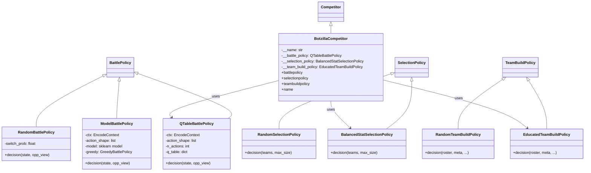

# 🔍 BotzillaSubmission 분석 보고서

> **제출자:** Botzilla  
> **분석일:** 2026-05-14  
> **파일 수:** 5개 Python 파일 + 1개 Q-Table CSV (약 42MB)

---

## 1. 코드 구조 개요

```
BotzillaSubmission/
├── main.py                      # 진입점 (서버 연결)
├── botzillaCompetitor.py        # Competitor 클래스 (정책 조립)
├── botzillaTeamBuildPolicy.py   # 팀 빌드 정책 (2가지)
├── botzillaSelectionPolicy.py   # 포켓몬 선택 정책 (2가지)
├── botzillaBattlePolicy.py      # 배틀 정책 (3가지)
└── q_table.csv                  # 사전 학습된 Q-Table (~42MB)
```

### 클래스 다이어그램



---

## 2. 각 파일 상세 분석

### 2.1 `main.py` — 진입점

- `RemoteCompetitorManager`를 통해 서버에 접속
- `--id` 인자로 포트 번호를 결정 (`BASE_PORT + id`)
- 특별한 로직 없이 표준 진입점 구조

### 2.2 `botzillaCompetitor.py` — 정책 조립

| 정책 슬롯 | 사용 클래스 | 설명 |
|---|---|---|
| **배틀** | `QTableBattlePolicy` | Q-Table 기반 강화학습 정책 |
| **선택** | `BalancedStatSelectionPolicy` | 스탯 균형 + 타입 다양성 기반 선택 |
| **팀빌드** | `EducatedTeamBuildPolicy` | 종합 스탯 상위 포켓몬 선택 |

- Q-Table은 `q_table.csv`에서 로드
- `EncodeContext()` + `action_shape=[10, 10]`으로 QTable 초기화

### 2.3 `botzillaTeamBuildPolicy.py` — 팀 빌드 전략

#### `RandomTeamBuildPolicy` (미사용, 백업)
- 로스터에서 3마리를 무작위 선택
- EV는 510을 6스탯에 균등 분배 (다항분포)
- Nature, Moves 모두 랜덤

#### `EducatedTeamBuildPolicy` ⭐ (실제 사용)
- **핵심 전략:** `calculate_stats(base_stats, level=100)` 으로 레벨 100 기준 실 스탯 총합을 계산
- 전체 로스터를 **종합 스탯이 높은 순으로 정렬**하여 상위 `max_team_size`마리 선택
- IV는 올맥스 `(31,) * 6`
- **약점:** EV 배분과 Nature는 여전히 **랜덤** → 최적화 여지 큼
- **약점:** 기술(Moves)도 무작위 선택 → 시너지 고려 없음

### 2.4 `botzillaSelectionPolicy.py` — 포켓몬 선택 전략

#### `RandomSelectionPolicy` (미사용)
- 단순 셔플 후 `max_size`만큼 선택

#### `BalancedStatSelectionPolicy` ⭐ (실제 사용)

**스코어링 공식:**
```
score = total_base_stats + (move_count × 10) - (type_penalty × 15)
```

| 요소 | 가중치 | 의도 |
|---|---|---|
| 종합 베이스 스탯 | +1 (절대값) | 전투력 높은 포켓몬 우선 |
| 보유 기술 수 | +10/개 | 다양한 기술을 가진 포켓몬 선호 |
| 타입 중복 패널티 | -15/회 | 이미 선택된 타입과 겹치면 감점 |

- **타입 다양성 보장:** 아직 사용되지 않은 타입의 포켓몬을 먼저 선택하는 2차 필터링 존재
- 결과적으로 **스탯이 높고, 기술이 많고, 타입이 겹치지 않는** 포켓몬을 선택

### 2.5 `botzillaBattlePolicy.py` — 배틀 전략

#### `RandomBattlePolicy` (미사용)
- 15% 확률로 교체, 나머지는 랜덤 공격

#### `QTableBattlePolicy` ⭐ (실제 사용, 그러나 버그 존재)

> **⚠️ 치명적 버그 발견:** `debug_mode = True`로 하드코딩되어 있어 Q-Table을 **절대 참조하지 않는다.**
> 결과적으로 **항상 `GreedyBattlePolicy`로 폴백**한다.

**의도된 동작 흐름:**
1. 현재 State를 `encode_state()`로 5000차원 벡터로 인코딩
2. 소수점 1자리로 반올림하여 state key 생성 (첫 2179개 요소만 사용)
3. Q-Table에서 해당 state key로 검색
4. Q값이 가장 높은 action 선택
5. `np.unravel_index`로 (10, 10) shape의 2D 행동으로 디코딩
6. action_id < 8이면 공격 (move_idx = id // 2, target = id % 2)
7. action_id >= 8이면 교체 (switch_idx = id - 8)

**실제 동작:** `debug_mode = True` 조건문 때문에 Q-Table 분기를 건너뛰고, `GreedyBattlePolicy().decision(state)`가 **항상** 실행됨.

```python
# 문제의 코드 (line 84, 89, 107-108)
debug_mode = True  # ← 항상 True

if not debug_mode and state_key in q_table:  # ← 절대 진입 불가
    action_id = int(np.argmax(q_table[state_key]))
    ...

# 이 코드는 try/except 바깥에 있어 무조건 실행됨
fallback_pol = GreedyBattlePolicy()
commands = fallback_pol.decision(state)  # ← 결국 이것만 실행
```

#### `ModelBattlePolicy` (코드에 존재하나 미사용)
- `trained_classifier.joblib`에서 sklearn 모델을 로드하여 행동 예측
- 파일이 제출물에 포함되지 않았고, Competitor에서도 사용하지 않음

---

## 3. 전략 종합 평가

### 3.1 의도된 전략 vs 실제 전략

| 단계 | 의도된 전략 | 실제 동작 |
|---|---|---|
| **팀 빌드** | 종합 스탯 상위 포켓몬 선택 | ✅ 의도대로 작동 |
| **선택** | 스탯+기술+타입다양성 스코어링 | ✅ 의도대로 작동 |
| **배틀** | Q-Table 강화학습 기반 의사결정 | ❌ **GreedyBattlePolicy 폴백** |

### 3.2 전략 철학

- **"우직한 파워" 스타일:** 스탯 총합이 높은 포켓몬을 모으고, Greedy(탐욕) 전략으로 매 턴 최선의 행동 선택
- 강화학습(Q-Table) 시도를 했으나, 디버깅 플래그를 켠 채로 제출한 것으로 보임
- 42MB Q-Table 파일이 존재하므로 상당한 학습을 진행했으나, 최종 제출에서 활용하지 못함

### 3.3 장점

| 장점 | 설명 |
|---|---|
| **Q-Learning 시도** | 강화학습 기반 배틀 정책을 구현하려 한 점은 높은 수준의 접근 |
| **타입 다양성 고려** | 선택 정책에서 타입 중복 패널티를 적용, 메타 대응력 향상 |
| **모듈화** | Random/Educated/QTable 등 여러 정책을 준비하여 교체 가능한 구조 |
| **Fallback 전략** | Q-Table 실패 시 Greedy로 폴백하는 안전장치 |

### 3.4 약점

| 약점 | 심각도 | 설명 |
|---|---|---|
| `debug_mode = True` 버그 | 🔴 **치명적** | Q-Table이 완전히 무시됨 |
| EV/Nature 랜덤 배분 | 🟡 중간 | 팀빌드에서 최적 분배가 아닌 랜덤 |
| 기술 선택 랜덤 | 🟡 중간 | 시너지 없는 무작위 기술 배정 |
| State key 충돌 가능성 | 🟠 낮음 | 반올림으로 인한 상태 구분 손실 |
| `eval()` 사용 | 🟠 보안 | CSV 로딩 시 `eval(row[0])` — 보안 취약점 |

### 3.5 Greedy 폴백의 의미

실질적으로 Botzilla는 **GreedyBattlePolicy**로 전투합니다. 이 정책은 엔진 내장 기본 정책으로, 매 턴 **가장 높은 데미지를 줄 수 있는 기술**을 선택하는 단순한 전략입니다. 상성 계산과 기본 데미지 공식을 활용하지만, 교체 타이밍이나 장기적 전략을 고려하지는 않습니다.

---

## 4. 결론

Botzilla는 **강화학습(Q-Learning) 기반 배틀 AI**를 목표로 했으나, `debug_mode` 플래그 실수로 인해 **사실상 Greedy 전략**으로 대회에 참가한 것으로 보입니다. 팀 빌드와 선택 단계에서는 합리적인 휴리스틱(스탯 기반 정렬, 타입 다양성 스코어링)을 적용했으며, 코드 구조도 모듈화가 잘 되어 있습니다. 42MB의 Q-Table 파일이 학습 노력의 흔적을 보여주지만, 최종 실행에서는 활용되지 않는 아쉬운 결과입니다.
