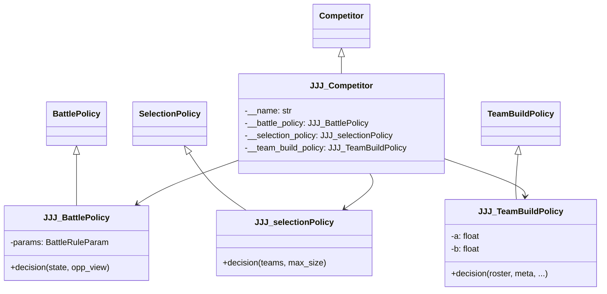
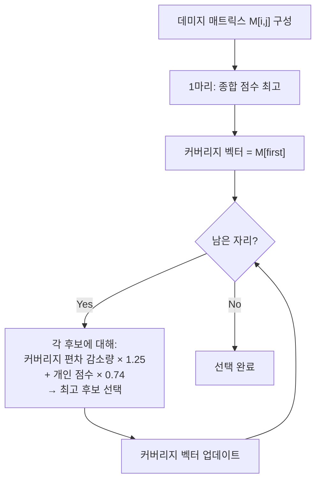

# 🔍 JJJ (JunSung) 분석 보고서

> **제출자:** JunSung (wfd gfd)  
> **분석일:** 2026-05-14  
> **파일 수:** 5개 (Python 3 + README + main)  
> **총 코드량:** ~420줄  
> **특징:** **2024 챔피언 Punisher 전략 기반** + **Focus Fire (집중 사격)** + **타입 랭크 매트릭스** 수학적 선택

---

## 1. 코드 구조 개요

```
JJJ - JunSung - wfd gfd/
├── main.py              # 진입점 (서버 연결)
├── JJJCompetitor.py     # Competitor 클래스 (정책 조립)
├── JJJ.py               # ⭐ 배틀 + 선택 정책 (218줄)
├── JJJTeamPolicy.py     # ⭐ 팀빌드 정책 (168줄)
└── README.txt           # 설명 (Punisher 기반 명시)
```

### 클래스 다이어그램



---

## 2. 핵심 전략: Focus Fire (집중 사격)

README에서 명시: **"2024 대회 챔피언 Punisher의 전략을 기반"**

### 핵심 철학
> 두 포켓몬이 **같은 적 하나를 집중 공격**하여 빠르게 처치한다.

---

## 3. 배틀 정책: Greedy Focus Fire

### 3.1 싱글 활성 (`attacker_single_greedy`)

```
모든 (기술, 적) 조합에서 데미지 비율이 가장 높은 것을 선택
```

- PP가 0이거나 disabled된 기술 제외
- 변화 기술(OTHER 카테고리) **완전 무시** — 오직 공격 기술만 사용

### 3.2 더블 활성 (`attacker_duo_focus_fire`) ⭐

```python
for di, d in enumerate(defenders):         # 각 적에 대해
    for mv1 in atks[0].battling_moves:     # 포켓몬1의 기술
        for mv2 in atks[1].battling_moves: # 포켓몬2의 기술
            total = damage_ratio(atk1, d, mv1) + damage_ratio(atk2, d, mv2)
            # → 합산 데미지가 최대인 조합 선택
```

**핵심:** 두 포켓몬이 **반드시 같은 적을 공격** (같은 `di` 타겟)

> **Focus Fire의 이유:** 더블배틀에서 적 1마리를 빠르게 처치하면 2v1 상황을 만들 수 있다. 데미지를 분산하면 적 2마리 모두 생존하여 반격 기회를 준다.

### 3.3 데미지 계산 (`estimate_damage_ratio`)

**자체 데미지 공식 구현** (엔진 함수 미사용):

```python
base_power = move.base_power + 12 * move.priority - 6  # 선제기 보너스 반영
stab = 1.5 if move_type in attacker.types else 1.0
type_mul = Π(DAMAGE_MULTIPLICATION_ARRAY[move_type][def_type])

dmg = ((2 * 100 / 5) + 2) * base_power * atk_stat / def_stat / 50 + 2
final = dmg * stab * type_mul
return final / defender.MAX_HP  # HP 대비 데미지 비율로 반환
```

| 요소 | 반영 여부 | 방식 |
|---|---|---|
| 레벨 | ✅ | 고정 100 |
| STAB | ✅ | ×1.5 |
| 타입 상성 | ✅ | 자체 19×19 배열 |
| 공격/방어 스탯 | ✅ | 물리/특수 분기 |
| 선제기 보너스 | ✅ | `base_power + 12 × priority - 6` |
| 날씨/지형 | ❌ | 미반영 |
| 랭크업/다운 | ❌ | 미반영 |

> **주목:** `base_power + 12 * priority - 6` — 선제기의 가치를 **위력에 직접 가산**하는 독특한 방식

---

## 4. 선택 정책: 균형 잡힌 커버리지 선택

### 4.1 알고리즘 (`select_best_n_attackers_balanced`)

**numpy 기반 수학적 선택 알고리즘:**

#### Step 1: 데미지 매트릭스 구성
```
damage_matrix[i][j] = 내 포켓몬 i가 적 포켓몬 j에게 줄 수 있는 최대 데미지 비율
```

#### Step 2: 포켓몬별 종합 점수
```
score = 1.07 × Σ(적 전원 대비 최대 데미지) + 0.42 × 방어력 배율
```

**방어력 배율:**
```
defensive_multiplier = (HP/402) × (방어/257) × (특방/257)
```

#### Step 3: 탐욕적 + 커버리지 균형 선택

```python
# 1마리: 종합 점수 최고를 선택
first = argmax(score_vec)
coverage = damage_matrix[first]  # 이 포켓몬의 적별 데미지 분포

# 2마리~: 커버리지 균형을 고려
for each candidate:
    new_coverage = coverage + damage_matrix[candidate]
    range_diff = new_coverage.max() - new_coverage.min()  # 커버리지 편차
    delta_range = old_range - new_range  # 편차 감소량
    val = 1.25 × delta_range + 0.74 × score  # 균형 개선 + 개인 점수
```

**핵심:** 단순히 강한 포켓몬을 고르는 것이 아니라, **팀 전체의 데미지 커버리지가 균일해지도록** 선택



---

## 5. 팀빌드 정책: 타입 랭크 매트릭스

### 5.1 타입 랭크 매트릭스 (`build_type_rank_matrix`)

**각 타입에 대해 모든 후보 포켓몬의 공격력을 순위화:**

```
rank_matrix[type_i][pkm_j] = 포켓몬 j가 타입 i에 대해 몇 번째로 강한가
```

- 19개 타입 × N마리 후보 → 순위 매트릭스
- `np.argsort(np.argsort(...))` 이중 정렬로 순위 계산

### 5.2 팀 선택 (`select_team`)

```
score = a × sum_ranks[j] + b × range_diff
```

| 요소 | 가중치 | 의미 |
|---|---|---|
| `sum_ranks` | a = 0.45 | 전체 타입 대비 **종합 공격 순위** (낮을수록 좋음) |
| `range_diff` | b = 0.45 | 타입별 **커버리지 편차** (낮을수록 균일) |

**첫 번째:** `sum_ranks` 최소 포켓몬 (전체 타입에 골고루 강한 포켓몬)  
**이후:** `score` 최소 후보를 탐욕적으로 추가 (균일한 커버리지 유지)

### 5.3 후보 풀 필터링

```python
high_hp = [p for p in roster if p.base_stats[0] >= 120]  # HP 120 이상 우선
if len(high_hp) >= max_team_size:
    candidates = high_hp
else:
    candidates = high_hp + 나머지  # HP 높은 포켓몬 우선 + 부족하면 채움
```

> **HP 120 이상 우선** — 높은 내구력으로 Focus Fire 전략의 생존성 확보

### 5.4 EV/Nature 배분

| 조건 | Nature | EV 배분 (HP/공/방/특공/특방/스피드) |
|---|---|---|
| 물리 공격 합 > 특수 | ADAMANT (공↑ 특공↓) | 252 / 168 / 0 / 84 / 0 / 6 |
| 특수 공격 합 > 물리 | MODEST (특공↑ 공↓) | 252 / 84 / 0 / 168 / 0 / 6 |
| 동일 | HASTY (스피드↑ 방↓) | 254 / 128 / 0 / 128 / 0 / 0 |

**특이점:**
- **HP에 항상 252** 투자 — "맷집" 중시 (Focus Fire와 시너지)
- **스피드에 6만** 투자 — 선공보다 **화력+생존** 우선
- 물리형에서도 특공에 84 투자 — **양도류(Mixed) 성향**
- 기술은 **랜덤 선택** (`choice`)

---

## 6. 데미지 계산 버그 분석

### 6.1 `max_expected_damage_against_type` 연산자 우선순위 버그

```python
raw = 0.84 * P * A / 1 + 2
# 의도: 0.84 * P * A / (1 + 2) = 0.84 * P * A / 3
# 실제: (0.84 * P * A / 1) + 2 = 0.84 * P * A + 2
```

> **⚠️ 괄호 누락:** `/1 + 2`는 `/(1+2)`가 아닌 `/1` 후 `+2`로 계산됨. 데미지가 과대평가되지만 **모든 포켓몬에 동일하게 적용**되어 상대적 순위에는 큰 영향 없음.

---

## 7. 전략 종합 평가

### 7.1 전체 전략 요약

| 단계 | 전략 | 접근법 |
|---|---|---|
| **팀 빌드** | HP 120+ 우선 → 타입 랭크 매트릭스 → 커버리지 균일화 | ✅ 수학적 |
| **선택** | 데미지 매트릭스 → 커버리지 균형 탐욕 선택 | ✅ 수학적 |
| **배틀** | **Focus Fire** — 두 포켓몬이 같은 적 집중 공격 | ✅ 전략적 |

### 7.2 전략 철학

- **"집중 사격 탱커" 스타일:** HP 높은 포켓몬으로 버티면서, 두 포켓몬이 한 적을 집중 공격하여 빠르게 수적 우위 확보
- 2024 챔피언 **Punisher 전략**을 공식적으로 참고
- 복잡한 탐색 없이 **수학적 최적화**로 빠르고 일관된 결정

### 7.3 장점

| 장점 | 설명 |
|---|---|
| **Focus Fire** | 더블배틀 핵심 전략 — 적 1마리 빠른 처치로 수적 우위 |
| **수학적 선택** | numpy 기반 랭크 매트릭스/데미지 매트릭스로 정량적 판단 |
| **커버리지 균일화** | 특정 타입에만 강하지 않고 **모든 타입에 골고루** 대응 |
| **HP 중시** | Focus Fire 전략에서 살아남아야 집중 공격이 가능 |
| **자체 데미지 공식** | 엔진 함수 의존 없이 독립적 계산 — 빠르고 예측 가능 |
| **챔피언 전략 참고** | 검증된 전략을 기반으로 구현 |
| **코드 간결** | ~420줄로 핵심 전략을 깔끔하게 구현 |

### 7.4 약점

| 약점 | 심각도 | 설명 |
|---|---|---|
| 변화 기술 무시 | 🟡 중간 | 상태이상, 랭크업, 환경 설치 등 완전 무시 |
| 교체 전략 없음 | 🟡 중간 | 불리한 매치업에서도 교체하지 않음 |
| 기술 랜덤 선택 | 🟡 중간 | 팀빌드에서 기술을 무작위 배정 |
| 스피드 무시 | 🟡 중간 | EV에 스피드 6만 배분 — 선공권 포기 |
| 데미지 공식 버그 | 🟠 낮음 | `0.84 * P * A / 1 + 2` 괄호 누락 |
| 날씨/지형 미반영 | 🟠 낮음 | 환경 효과 완전 무시 |
| 보호/방어 기술 무시 | 🟡 중간 | 적이 프로텍트 사용 시 Focus Fire 낭비 |

---

## 8. 이전 제출물과 비교

| 비교 항목 | Botzilla | Caaaden | evoTrainer | iceMonte | jirachi | **JJJ** |
|---|---|---|---|---|---|---|
| **접근법** | Q-Learning | 휴리스틱 | 규칙+EA | MCTS | Beam Search | **수학적 최적화** |
| **코드량** | ~300줄 | 326줄 | ~550줄 | ~680줄 | ~2,560줄 | **~420줄** |
| **팀빌드** | 스탯 기반 | 역할별 | ❌ 없음 | 역할+조합 | 환경+5역할 | **랭크 매트릭스** |
| **선택** | 타입다양성 | 카운터픽 | 단순 순서 | 조합전수탐색 | 3전략분기 | **커버리지 균형** |
| **배틀** | Greedy폴백 | 데미지+KO | 유전자규칙 | MCTS | Beam Search | **Focus Fire** |
| **EV 스타일** | 랜덤 | 어태커형 | ❌ | 역할별 | 스피드올인 | **HP 올인** |
| **교체** | 없음 | 기절 시 | 불리매치 | 상태이상 | 없음 | **없음** |
| **독창성** | 중간 | 낮음 | 높음 | 높음 | 높음 | **높음** |

---

## 9. 결론

JJJ(JunSung)는 2024 챔피언 Punisher의 전략을 참고하여 **Focus Fire(집중 사격)**를 핵심으로 한 AI를 구현했습니다. 더블배틀에서 두 포켓몬이 반드시 같은 적을 공격하여 **빠른 처치 → 수적 우위**를 노리는 전략은 단순하지만 효과적입니다.

numpy 기반 **타입 랭크 매트릭스**와 **데미지 매트릭스**를 사용한 수학적 팀 선택은 독창적이며, 커버리지 균일화를 통해 특정 타입에 치명적으로 약한 상황을 방지합니다. HP 252 고정 EV 배분은 Focus Fire 전략에서 **"살아남아 집중 공격을 완수"**하기 위한 일관된 선택입니다.

다만 변화 기술 무시, 교체 전략 부재, 기술 랜덤 선택 등의 약점이 있으며, 특히 **스피드에 거의 투자하지 않아** 상대에게 선공을 허용합니다.

**한 줄 요약:** 챔피언 전략 기반의 Focus Fire + 수학적 커버리지 선택. 단순하지만 더블배틀의 핵심을 정확히 꿰뚫는 전략.
