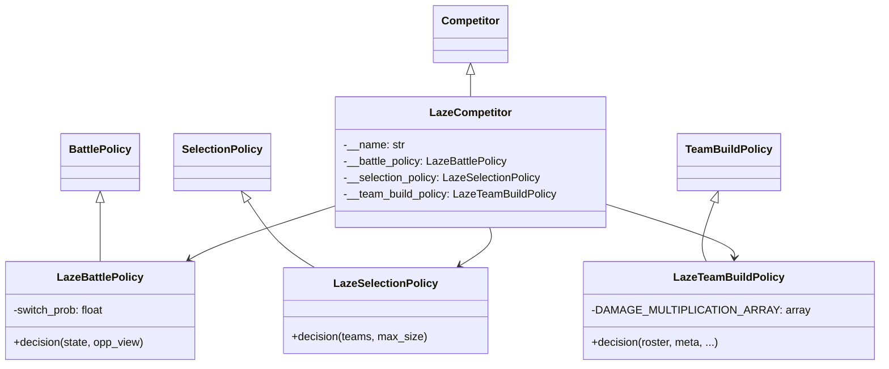
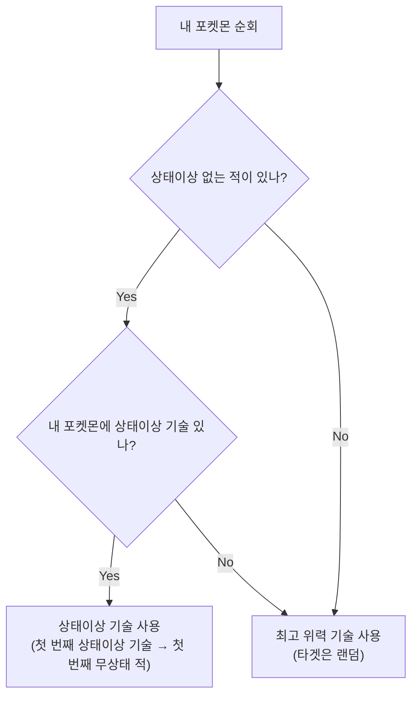
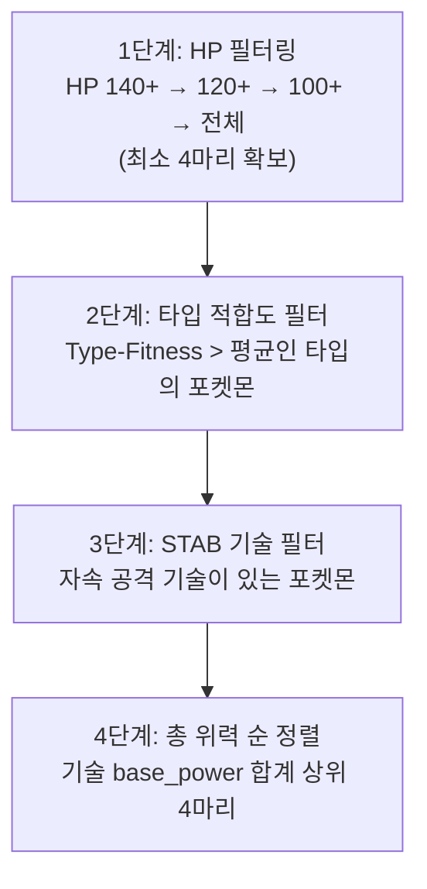

# 🔍 LazeComp 분석 보고서

> **제출자:** LazeComp  
> **분석일:** 2026-05-14  
> **파일 수:** 5개 Python 파일  
> **총 코드량:** ~200줄 (대회 최소 수준)  
> **특징:** **상태이상 우선 전략** + **타입 적합도(Type-Fitness) 기반 팀빌드** + EV/Nature 랜덤

---

## 1. 코드 구조 개요

```
LazeComp/
├── main.py                  # 진입점 (서버 연결)
├── LazeCompetitor.py        # Competitor 클래스 (정책 조립)
├── LazeTeamBuildPolicy.py   # ⭐ 팀빌드 (타입 적합도 필터링, 74줄)
├── LazeSelectionPolicy.py   # 선택 (상태이상 기술 기반, 24줄)
└── LazeBattlePolicy.py      # 배틀 (상태이상 우선 + 최고위력, 53줄)
```

### 클래스 다이어그램



---

## 2. 배틀 정책 (`LazeBattlePolicy`)

### 2.1 행동 결정 우선순위



### 2.2 상세 분석

```python
# 1순위: 상태이상이 없는 적에게 상태이상 기술 사용
status_targets = [적 중 status == NONE인 것들]
if status_targets and 내가 상태이상 기술 보유:
    첫 번째 상태이상 기술 → 첫 번째 무상태 적

# 2순위: 최고 위력 기술 사용 (타겟 랜덤)
highest_power_move = max(base_power)
target = random_choice(적 활성 포켓몬)
```

**특징:**
- **상태이상 우선:** 적에게 상태이상을 먼저 거는 것이 최우선
- 상태이상 기술이 없거나 적 전원이 이미 상태이상이면 **최고 위력 기술**
- **타겟은 완전 랜덤** (균일 분포)

### 2.3 미사용 파라미터

```python
def __init__(self, switch_prob: float = .15):
    self.switch_prob = switch_prob  # 정의만 있고 사용되지 않음
```

> **⚠️ switch_prob 미사용:** 교체 확률이 정의되어 있지만 실제 교체 로직이 없음

---

## 3. 선택 정책 (`LazeSelectionPolicy`)

### 3.1 알고리즘

```python
for 각 포켓몬:
    status_count = 해당 포켓몬이 가진 상태이상 기술 수
result = status_count 내림차순 정렬
```

> **상태이상 기술이 많은 포켓몬을 우선 선택**

### 3.2 버그 분석

```python
for i in range(len(teams[0].members)):
    pokemon = teams[0].members[i]
    status_count = 0
    for j in range(len(pokemon.moves)):
        move = pokemon.moves[j]
        if move.status != 0:
            status_count += 1
        status_list.append([i, status_count])  # ← 들여쓰기 오류!
```

> **🔴 치명적 버그 (들여쓰기):** `status_list.append`가 for-j 루프 **안에** 있어서, 기술 하나마다 한 번씩 append됨.  
> 예: 4개 기술을 가진 포켓몬 6마리 → status_list에 **24개 항목** 생성 (중복 포함).  
> → 정렬 후 `result`에 **같은 인덱스가 여러 번** 들어가고, `max_size`로 잘리므로 일부 포켓몬만 선택될 수 있음.

**의도된 동작 (추정):**
```python
# append가 for-j 루프 바깥에 있어야 함:
for i in range(len(teams[0].members)):
    status_count = ...
    status_list.append([i, status_count])  # ← 여기
```

---

## 4. 팀빌드 정책 (`LazeTeamBuildPolicy`)

### 4.1 4단계 필터링 파이프라인



### 4.2 타입 적합도 (Type-Fitness) 계산

```python
# 로스터 전체의 타입 분포 계산
typeCount[t] = 로스터에서 타입 t를 가진 포켓몬 수

# HP 필터된 포켓몬들의 타입 적합도
for pkmn in hp_filtered:
    for pkmn2 in roster:
        for type1 in pkmn.types:
            for type2 in pkmn2.types:
                typeFitness[type1] += (상성배율[type1][type2] - 1) × typeCount[type2]
```

**의미:**
- `상성배율 > 1` (효과 좋음) → 적합도 **증가**
- `상성배율 < 1` (효과 나쁨) → 적합도 **감소**
- `typeCount` 가중: 로스터에 많은 타입에 대해 유리한 타입일수록 적합도 높음

> **핵심 아이디어:** "메타에서 많이 등장하는 타입을 잘 때리는 타입"을 우선

### 4.3 EV/Nature: 완전 랜덤

```python
evs = tuple(multinomial(510, [1/6] * 6, size=1)[0])  # 510 EV를 6스탯에 랜덤 배분
nature = Nature(choice(len(Nature), 1, False))         # 성격도 랜덤
```

> **⚠️ 완전 랜덤:** EV를 다항분포(multinomial)로 6스탯에 균일 확률로 분배. Nature도 랜덤.  
> → 최적화 의도 전혀 없음. "Laze(게으른)" 이름에 걸맞는 부분.

### 4.4 기술 선택: 랜덤

```python
moves = list(choice(n_moves, min(max_pkm_moves, n_moves), False))  # 랜덤 기술 선택
```

---

## 5. 전략 종합 평가

### 5.1 전체 전략 요약

| 단계 | 전략 | 수준 |
|---|---|---|
| **팀 빌드** | HP 필터 → 타입 적합도 → STAB 필터 → 위력 정렬 | 🟡 중간 |
| **선택** | 상태이상 기술 보유 수 기준 (버그 있음) | 🔴 버그 |
| **배틀** | 상태이상 우선 → 최고위력 (타겟 랜덤) | 🟠 기본 |

### 5.2 전략 철학

- **"상태이상 먼저, 공격은 나중에":** 적에게 상태이상을 건 후 높은 위력 기술로 공격
- 팀빌드에서 **타입 적합도(메타 카운터)**를 고려하는 것은 좋으나, EV/Nature/기술이 모두 랜덤
- 이름 "Laze(게으른)"가 전략적 투자 수준을 잘 반영

### 5.3 장점

| 장점 | 설명 |
|---|---|
| **상태이상 우선** | 상태이상의 가치를 이해 — 화상/마비 등은 장기전에서 유리 |
| **타입 적합도** | 로스터 메타를 분석하여 유리한 타입 선택 |
| **HP 필터링** | 단계적 HP 기준 (140→120→100) 으로 내구력 확보 |
| **STAB 필터** | 자속 공격 기술 보유 여부 확인 |
| **코드 간결** | ~200줄로 최소한의 전략 구현 |

### 5.4 약점

| 약점 | 심각도 | 설명 |
|---|---|---|
| 선택 정책 버그 | 🔴 **치명적** | 들여쓰기 오류로 중복 인덱스 발생 → 선택 왜곡 |
| EV 랜덤 배분 | 🔴 **심각** | 510 EV를 다항분포로 랜덤 → 최적화 없음 |
| Nature 랜덤 | 🔴 **심각** | 25개 성격 중 랜덤 선택 → 불리한 성격 가능 |
| 기술 랜덤 | 🟡 중간 | 핵심 기술 누락 가능 |
| 타겟 랜덤 | 🟡 중간 | 데미지 계산 없이 균일 랜덤 타겟 |
| 교체 없음 | 🟡 중간 | `switch_prob` 정의만 있고 미구현 |
| 타입 상성 무시 | 🟡 중간 | 배틀 중 기술 선택에 타입 상성 미반영 |
| 팀 크기 4 하드코딩 | 🟠 낮음 | 필터링에서 `>= 4` 기준 사용 (max_team_size 미참조) |

---

## 6. 이전 제출물과 비교

| 비교 항목 | Botzilla | Caaaden | evoTrainer | iceMonte | jirachi | JJJ | **LazeComp** |
|---|---|---|---|---|---|---|---|
| **접근법** | Q-Learning | 휴리스틱 | 규칙+EA | MCTS | Beam Search | Focus Fire | **상태이상 우선** |
| **코드량** | ~300줄 | 326줄 | ~550줄 | ~680줄 | ~2,560줄 | ~420줄 | **~200줄** |
| **팀빌드** | 스탯 기반 | 역할별 | ❌ 없음 | 역할+조합 | 환경+5역할 | 랭크매트릭스 | **타입적합도** |
| **선택** | 타입다양성 | 카운터픽 | 단순순서 | 조합전수탐색 | 3전략분기 | 커버리지균형 | **상태이상기술수** |
| **배틀** | Greedy폴백 | 데미지+KO | 유전자규칙 | MCTS | Beam Search | Focus Fire | **상태이상→위력** |
| **EV** | - | 역할별 | ❌ | 역할별 | 스피드올인 | HP올인 | **완전 랜덤** |
| **교체** | 없음 | 기절 시 | 불리매치 | 상태이상 | 없음 | 없음 | **없음** |
| **버그** | debug_mode | 없음 | 없음 | indent | 없음 | 괄호누락 | **indent+랜덤** |

---

## 7. 결론

LazeComp은 이름("Laze" = 게으른)에 걸맞게 **최소한의 구현**으로 대회에 참가한 제출물입니다. **상태이상 우선 전략**이라는 독자적인 철학은 흥미롭고, 화상/마비 등 상태이상의 장기전 가치를 이해하고 있습니다. 팀빌드의 **타입 적합도(Type-Fitness)** 계산은 로스터 메타를 분석하여 유리한 타입을 수학적으로 선택하는 좋은 아이디어입니다.

그러나 EV와 Nature가 **완전 랜덤**이고, 선택 정책에 **들여쓰기 버그**가 있으며, 배틀에서 **타겟이 랜덤**인 점이 치명적입니다. 교체 로직은 `switch_prob`이 정의되어 있지만 실제 사용되지 않습니다.

**한 줄 요약:** 상태이상 우선이라는 독자적 전략과 타입 적합도 분석이 좋지만, EV/Nature/기술/타겟이 모두 랜덤으로 잠재력을 살리지 못한 아쉬운 제출물.
