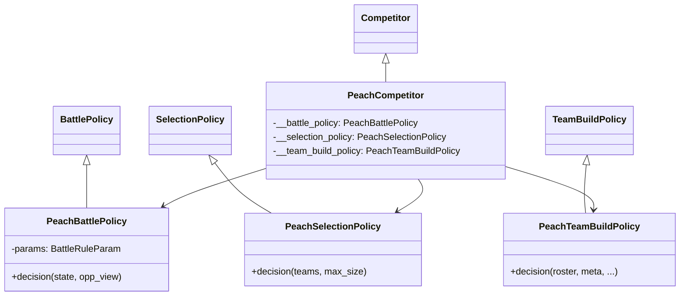
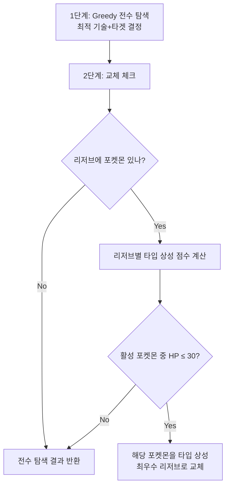
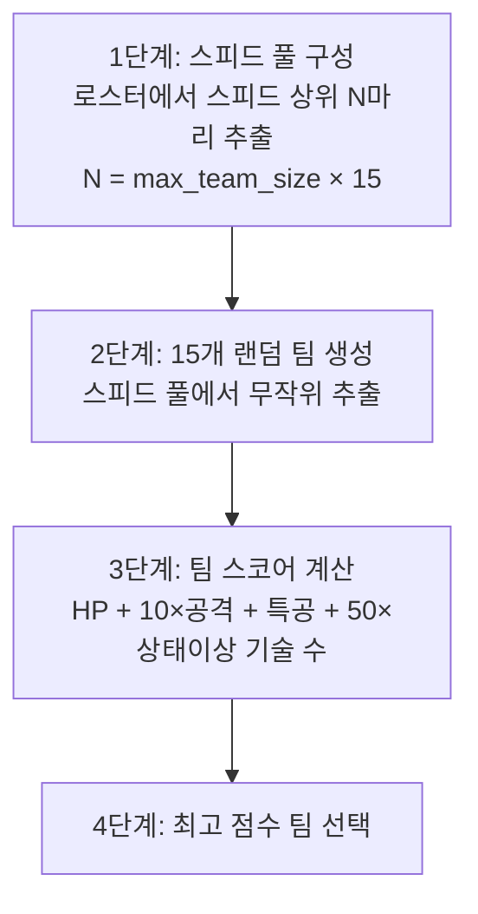

# 🔍 PeachSubmission 분석 보고서

> **제출자:** Lilly Gerlach, Anna-Lena Penk (2인 팀)  
> **분석일:** 2026-05-14  
> **파일 수:** 5개 Python 파일  
> **총 코드량:** ~240줄  
> **특징:** **스피드 풀 → 랜덤 팀 생성 → 최적 팀 선택** + **저HP 자발적 교체** + **타입 상성 기반 선택**

---

## 1. 코드 구조 개요

```
PeachSubmission/
├── main.py                    # 진입점 (서버 연결)
├── PeachCompetitor.py         # Competitor 클래스 (2인 공동 작업)
├── PeachBattlePolicy.py       # ⭐ 배틀 (전수 탐색 + 교체, 79줄)
├── PeachSelectionPolicy.py    # 선택 (타입 상성 점수, 40줄)
└── PeachTeamBuildPolicy.py    # 팀빌드 (스피드 풀 + 랜덤 팀, 69줄)
```

### 클래스 다이어그램



---

## 2. 배틀 정책 (`PeachBattlePolicy`)

### 2.1 2단계 의사결정



### 2.2 전수 탐색 (`adapted_greedy_double_battle_decision`)

minimon과 동일한 구조의 더블배틀 전수 탐색:

```python
for sources in product(기술 조합):
    for targets in product(타겟 조합):
        damage, ko = 시뮬레이션(HP 차감)
        
        # 명중률 가중
        damage *= move.accuracy
        
        # 상태이상 기술 보너스
        if move.status != 0:
            damage *= 1.2
            
strategies.append((ko, damage, sources, targets))
best = max(strategies, key=lambda x: 1000 * ko + damage)
```

**전략 점수:**
```
score = 1000 × ko + damage × accuracy × (1.2 if 상태이상)
```

### 2.3 자발적 교체 ⭐

```python
# 리저브 중 타입 상성이 가장 좋은 포켓몬 찾기
for i, reserve_pkm in enumerate(team.reserve):
    for enemy in enemy_team.active:
        score_res[i] += DAMAGE_MULTIPLICATION_ARRAY[my_type][enemy_type]

best_reserve = argmax(score_res)

# HP ≤ 30인 활성 포켓몬이 있으면 교체
for i, active_pkm in enumerate(team.active):
    if active_pkm.hp <= 30:
        greedy_des[i] = (-1, best_reserve)
        break
```

**교체 조건:**
- 활성 포켓몬의 **HP ≤ 30** (절대값 기준)
- 교체 대상: 현재 적 활성 포켓몬에 대해 **타입 상성 합이 가장 높은** 리저브

> **다른 제출물과 차이:** 대부분의 제출물에 교체 전략이 없는 반면, Peach는 **HP 기반 교체 + 타입 상성 기반 대상 선택**을 구현

---

## 3. 선택 정책 (`PeachSelectionPolicy`)

### 타입 상성 점수 기반 선택

```python
for 내 포켓몬 i:
    for 적 포켓몬:
        for 내 타입:
            for 적 타입:
                type_score[i] += DAMAGE_MULTIPLICATION_ARRAY[my_type][enemy_type]

# 점수 상위 max_size마리 선택 (argmax → 점수 -1 → 반복)
```

> **상대 팀 분석:** 상대 모든 멤버에 대해 내 타입의 공격 효율을 합산 → 상대에 가장 유리한 포켓몬 우선

- **장점:** 상대 팀 타입을 실제로 분석
- **약점:** 공격 타입만 고려 (방어 상성 미반영)

---

## 4. 팀빌드 정책 (`PeachTeamBuildPolicy`)

### 4.1 스피드 풀 → 랜덤 팀 → 최적 선택



### 4.2 팀 스코어 공식

```
team_score = Σ(HP + 10 × 공격 + 특공 + 50 × 상태이상기술수)
```

| 요소 | 가중치 | 의미 |
|---|---|---|
| HP | ×1 | 기본 내구력 |
| **공격** | **×10** | 물리 공격 최중시 |
| 특공 | ×1 | 특수 공격 (낮은 가중치) |
| **상태이상 기술 수** | **×50** | 상태이상 기술 보유 크게 보상 |

> **공격 ×10 + 상태이상 ×50:** "물리 공격이 강하고 상태이상 기술이 많은 팀"을 선호

### 4.3 EV/Nature: 고정값

```python
evs = (170, 140, 0, 100, 0, 100)  # HP/공격/방어/특공/특방/스피드
nature = Nature(3)  # ADAMANT (공격↑ 특공↓)
```

| 스탯 | EV | 설명 |
|---|---|---|
| HP | 170 | 내구력 |
| 공격 | 140 | 물리 화력 |
| 방어 | 0 | - |
| 특공 | 100 | 특수 화력 |
| 특방 | 0 | - |
| 스피드 | 100 | 선공 |

**총 합계: 610** (⚠️ 510 제한 초과)

> **🔴 EV 합계 버그:** EV 합계가 610으로 **510 제한을 100 초과**. 엔진이 이를 어떻게 처리하느냐에 따라 에러 또는 무시될 수 있음.

**Nature:** 모든 포켓몬에 ADAMANT (공격↑ 특공↓) 고정 → 특수 어태커에게도 물리 성격 적용

### 4.4 기술 선택: 랜덤

```python
moves = list(choice(n_moves, min(max_pkm_moves, n_moves), False))
```

---

## 5. 전략 종합 평가

### 5.1 전체 전략 요약

| 단계 | 전략 | 수준 |
|---|---|---|
| **팀 빌드** | 스피드 풀 → 15팀 랜덤 → 최적 선택 | 🟡 아이디어 좋으나 버그 |
| **선택** | 상대 타입 상성 합산 점수 | ✅ 상대 분석 |
| **배틀** | 전수 탐색 + **저HP 교체** + 상태이상 보너스 | ✅ 균형 잡힌 |

### 5.2 전략 철학

- **"빠르고 강한 팀 + 위기 시 교체":** 스피드 높은 포켓몬 풀에서 공격력과 상태이상 기술이 뛰어난 팀을 선택하고, 배틀 중 HP가 낮아지면 타입 상성이 좋은 리저브로 교체
- 상태이상 기술의 가치를 팀빌드(×50)와 배틀(×1.2) 모두에서 반영

### 5.3 장점

| 장점 | 설명 |
|---|---|
| **자발적 교체** | HP ≤ 30 시 타입 상성 기반 교체 — 대회에서 드문 기능 |
| **상대 팀 분석 선택** | 상대 전원의 타입을 분석하여 유리한 포켓몬 선택 |
| **전수 탐색 배틀** | 모든 기술-타겟 조합 탐색 + HP 시뮬레이션 |
| **명중률 반영** | `damage × accuracy`로 불안정 기술 페널티 |
| **상태이상 보너스** | 팀빌드와 배틀 모두에서 상태이상 가치 반영 |
| **다중 팀 후보** | 15개 랜덤 팀 생성 후 최적 선택 — 단순 탐욕보다 우수 |

### 5.4 약점

| 약점 | 심각도 | 설명 |
|---|---|---|
| **EV 합계 610** | 🔴 **치명적 버그** | 510 제한 초과 — 에러 또는 무효 가능 |
| ADAMANT 고정 | 🟡 중간 | 특수 어태커에도 물리 성격 → 특공 하락 |
| 기술 랜덤 | 🟡 중간 | 핵심 기술 누락 가능 |
| HP 30 절대값 | 🟠 낮음 | HP 비율이 아닌 절대값 → 고HP 포켓몬에 불리 |
| 교체 1회만 | 🟠 낮음 | `break`로 첫 저HP 포켓몬만 교체 |
| 방어 상성 미반영 | 🟠 낮음 | 선택에서 공격 상성만 고려 |
| 랜덤 팀 의존 | 🟡 중간 | 15개 랜덤 팀 중 최적 → 운에 의존 |

---

## 6. 명중률 가중 방식의 문제

```python
damage += hp[target] - new_hp  # 데미지 누적
damage *= move.constants.accuracy  # ← 누적된 전체 데미지에 명중률 곱셈!
```

> **⚠️ 누적 곱셈 버그:** 명중률이 해당 기술의 데미지가 아닌 **지금까지 누적된 총 데미지**에 곱해짐. 두 번째 포켓몬의 기술 명중률이 첫 번째 데미지에도 영향을 미침.

---

## 7. 이전 제출물과 비교

| 비교 항목 | Botzilla | Caaaden | evoTrainer | iceMonte | jirachi | JJJ | LazeComp | minimon | **Peach** |
|---|---|---|---|---|---|---|---|---|---|
| **접근법** | Q-Learn | 휴리스틱 | 규칙+EA | MCTS | BeamSearch | FocusFire | 상태이상 | 전수탐색 | **전수탐색+교체** |
| **코드량** | ~300 | 326 | ~550 | ~680 | ~2,560 | ~420 | ~200 | ~410 | **~240** |
| **팀빌드** | 스탯 | 역할별 | ❌ | 역할조합 | 환경5역할 | 랭크매트릭스 | 타입적합도 | 타입분석7역할 | **스피드풀+랜덤** |
| **선택** | 타입다양 | 카운터픽 | 순서 | 조합전수 | 3전략 | 커버리지 | 상태이상수 | 타입다양 | **상대타입분석** |
| **배틀** | Greedy | 데미지KO | 유전자 | MCTS | BeamSearch | FocusFire | 상태이상위력 | 전수탐색KO | **전수탐색+교체** |
| **교체** | ❌ | 기절시 | 불리매치 | 상태이상 | ❌ | ❌ | ❌ | ❌ | **✅ HP≤30** |
| **EV 버그** | - | - | - | - | - | - | 랜덤 | - | **합계 610** |

---

## 8. 결론

PeachSubmission(Lilly Gerlach, Anna-Lena Penk)은 2인 팀이 제출한 **균형 잡힌 AI**입니다. 더블배틀 전수 탐색, 상대 타입 분석 기반 선택, 그리고 **HP ≤ 30 시 타입 상성 기반 자발적 교체**까지 갖춘 것은 높이 평가됩니다. 특히 교체 전략은 대회 참가자 중 가장 실전적인 접근 중 하나입니다.

팀빌드에서 "스피드 풀 → 15개 랜덤 팀 → 최적 선택"이라는 아이디어도 흥미로우나, **EV 합계 610 (510 초과)** 버그와 **ADAMANT 고정** Nature, **기술 랜덤 선택**이 잠재력을 깎습니다. 명중률 누적 곱셈 버그도 데미지 평가를 왜곡합니다.

**한 줄 요약:** 교체 전략과 상대 분석이 돋보이는 균형 잡힌 AI이지만, EV 합계 초과 버그와 Nature 고정이 발목을 잡는 아쉬운 제출물.
