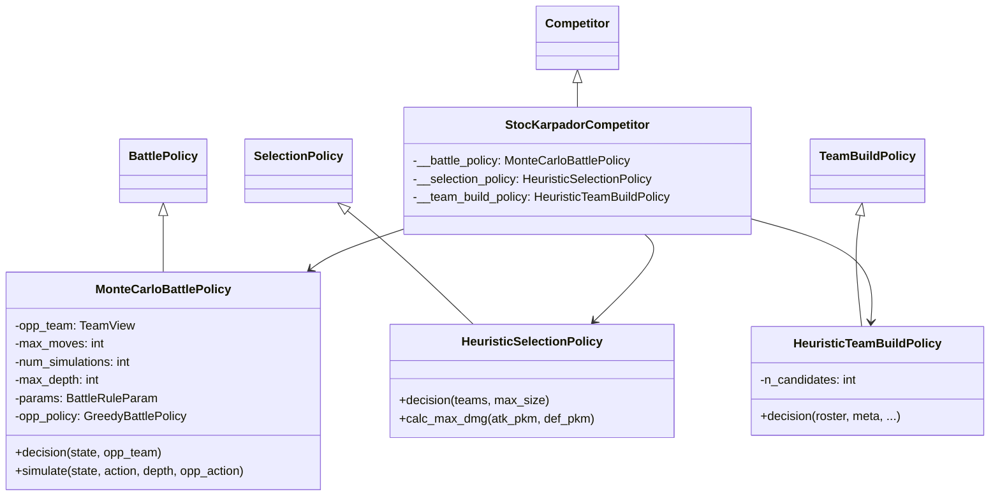
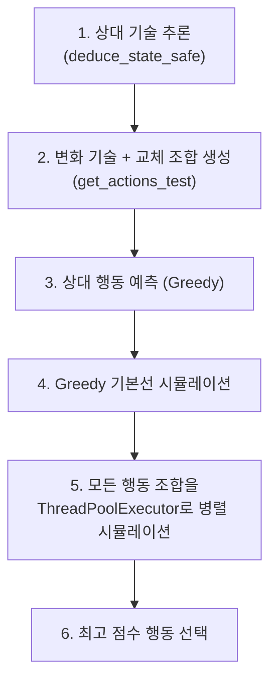
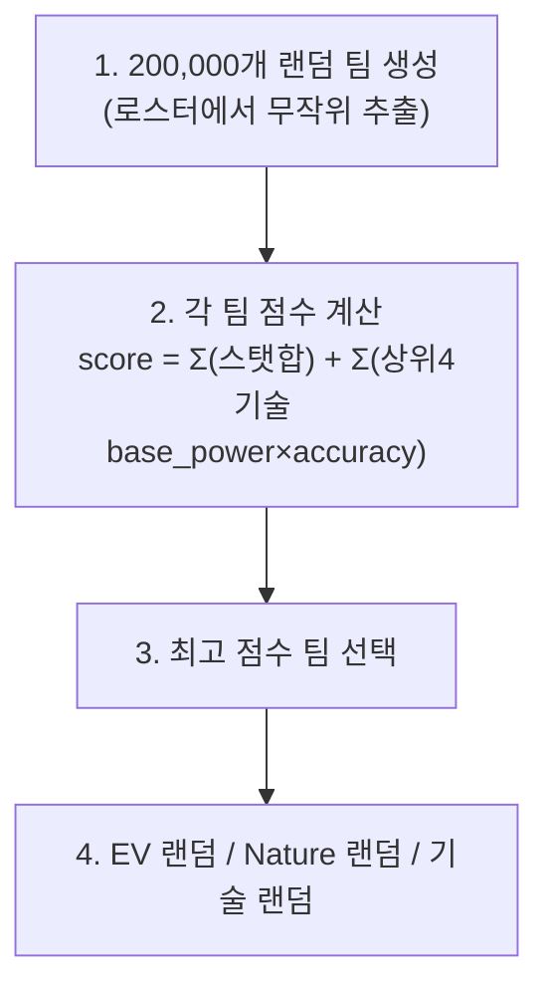

# 🔍 StocKarpadorSubmission 분석 보고서

> **제출자:** Fidelio Luc Reichard, Malte Rost (2인 팀)  
> **분석일:** 2026-05-14  
> **파일 수:** 6개 (Python 5 + PDF 문서 1)  
> **총 코드량:** ~365줄  
> **특징:** **Monte Carlo 시뮬레이션** + **멀티스레드 병렬 탐색** + **ZERO_RNG(결정적 시뮬레이션)** + **20만 팀 후보 생성** + **공방 차이 선택**

---

## 1. 코드 구조 개요

```
StocKarpadorSubmission/
├── main.py                            # 진입점 (서버 연결)
├── StocKarpadorCompetitor.py          # Competitor 클래스 (2인 팀)
├── StocKarpadorBattlePolicy.py        # ⭐ 배틀 (Monte Carlo + 멀티스레드, 185줄)
├── StocKarpadorSelectionPolicy.py     # ⭐ 선택 (공방 차이 점수, 40줄)
├── StocKarpadorTeamBuildPolicy.py     # 팀빌드 (20만 후보 생성, 89줄)
└── StocKarpador.pdf                   # 전략 설명 문서
```

### 클래스 다이어그램



---

## 2. 배틀 정책: Monte Carlo Simulation ⭐

### 2.1 전체 흐름



### 2.2 ZERO_RNG: 결정적 시뮬레이션

```python
forward(_state, (action, opp_action), self.params,
        acc_rng=tuple([tuple([ZERO_RNG, ZERO_RNG]), tuple([ZERO_RNG, ZERO_RNG])]))
```

> **핵심:** `ZERO_RNG`를 사용하여 **명중/회피 랜덤 요소를 제거** — 모든 기술이 반드시 적중하는 결정적 시뮬레이션. Monte Carlo의 랜덤성을 행동 선택에만 적용.

### 2.3 행동 후보 생성 (`get_actions_test`)

```python
# 변화 기술만 필터링! (공격 기술 제외)
moves = [i for i, m in enumerate(battling_moves) 
         if m.pp > 0 and not m.disabled and not is_attacking_move(attacker, i)]
```

**`is_attacking_move` — 매우 엄격한 공격 기술 판별:**
```python
def is_attacking_move(pokemon, attack_index):
    return (base_power > 0           # 위력 있음
        and not force_switch         # 강제 교체 아님
        and not self_switch          # 자기 교체 아님
        and not protect              # 방어 아님
        and boosts == (0,)*8         # 랭크 변화 없음
        and heal == 0                # 회복 없음
        and weather == CLEAR         # 날씨 설치 아님
        and terrain == NONE          # 지형 설치 아님
        and not trickroom            # 트릭룸 아님
        and not reflect/lightscreen  # 스크린 아님
        and not tailwind             # 순풍 아님
        and hazard == NONE           # 설치기 아님
        and status == NONE           # 상태이상 아님
        and not disable)             # 봉인 아님
```

> **⚠️ 반전 주목:** `get_actions_test`에서 `not is_attacking_move`로 필터링 — **변화 기술과 교체만** 후보에 포함. 공격 기술은 Greedy 기본선에서만 처리.

### 2.4 시뮬레이션 (`simulate`)

```python
def simulate(state, action, depth, opp_action):
    # 1턴: 선택한 행동 실행
    forward(state, (action, opp_action), params, ZERO_RNG)
    
    # depth턴: Greedy 정책으로 양측 행동 결정 후 실행
    for d in range(depth):
        if state.terminal(): return 100.0  # 승리 시 큰 보상
        my_action = greedy(state)
        opp_action = greedy(reversed_state)
        forward(state, (my_action, opp_action), params, ZERO_RNG)
    
    return eval_state_with_context(state)
```

**시뮬레이션 구조:**
- 첫 턴: 후보 행동(변화 기술/교체) 실행
- 이후 depth턴: 양측 Greedy로 시뮬레이션
- **결정적 환경** (ZERO_RNG) — 동일 입력에 동일 결과

### 2.5 상태 평가 (`eval_state_with_context`)

```
score = 3 × 내_HP비율합 - 5 × 적_HP비율합 + 2 × 내_생존수 - 2.5 × 적_생존수
```

| 요소 | 가중치 | 의미 |
|---|---|---|
| 내 HP 비율 합 | **+3** | 내 생존력 |
| 적 HP 비율 합 | **-5** | 적 HP 줄이기 (더 중시) |
| 내 생존 수 | +2 | 내 포켓몬 보존 |
| 적 생존 수 | -2.5 | 적 포켓몬 처치 |

> **비대칭 가중치:** 적 HP(-5)가 내 HP(+3)보다 높은 가중치 → **공격적 평가** (적을 죽이는 것이 내가 사는 것보다 중요)

### 2.6 멀티스레드 병렬 실행

```python
with concurrent.futures.ThreadPoolExecutor() as executor:
    results = executor.map(evaluate_single_action, tasks)
```

> **ThreadPoolExecutor:** 모든 행동 후보를 **병렬로 시뮬레이션** — 시간 내에 더 많은 행동을 평가. 대회 참가자 중 유일한 멀티스레드 사용.

---

## 3. 선택 정책 (`HeuristicSelectionPolicy`)

### 공방 차이 점수 ⭐

```python
for 내 포켓몬 i:
    offensive_score = Σ(내가 적에게 줄 수 있는 최대 데미지)  # 모든 적 대비
    defensive_score = Σ(적이 나에게 줄 수 있는 최대 데미지)  # 모든 적 대비
    effectiveness_score = offensive_score - defensive_score
```

**핵심:** 단순 공격력이 아닌 `공격 데미지 - 피격 데미지` = **순 효과**로 평가

- **`calc_max_dmg`:** 실제로 `BattlingPokemon`과 `State`를 생성하여 **엔진의 `calculate_damage` 호출** — 가장 정확한 데미지 계산
- 상위 4마리를 선택

> **다른 제출물과 차이:** 대부분 공격 상성만 보는 반면, StocKarpador는 **피격 데미지까지 고려** — 내가 잘 때리면서 덜 맞는 포켓몬을 선택

---

## 4. 팀빌드 정책 (`HeuristicTeamBuildPolicy`)

### 4.1 20만 랜덤 팀 후보 생성

```python
class HeuristicTeamBuildPolicy(TeamBuildPolicy):
    def __init__(self, n_candidates: int = 200000):  # 20만 팀 후보!
        self.n_candidates = n_candidates
```



### 4.2 팀 평가 (`evaluate_team`)

```python
stat_score = sum(calculate_stats(base_stats, level=100))  # 6스탯 합계
best_moves_score = sum(top_4(base_power × accuracy))       # 상위 4개 기술 점수
total_score = stat_score + best_moves_score
```

| 요소 | 계산 | 의미 |
|---|---|---|
| 스탯 점수 | 레벨 100 기준 6스탯 합계 | 전체적 강함 |
| 기술 점수 | `base_power × accuracy` 상위 4개 합 | 공격 잠재력 |

> **20만 팀 → 최고 점수:** 브루트포스 접근. 조합 탐색 대신 대량 랜덤 샘플링 → 통계적 최적

### 4.3 EV/Nature/기술: 랜덤

```python
evs = tuple(multinomial(510, [1/6]*6, size=1)[0])  # 랜덤
nature = Nature(choice(len(Nature), 1, False))       # 랜덤
move_indices = list(choice(..., replace=False))       # 랜덤
```

> **⚠️ 20만 팀 후보로 좋은 포켓몬을 고르지만, EV/Nature/기술은 완전 랜덤** — 포켓몬 선택의 노력이 빌드 단계에서 낭비됨

---

## 5. 전략 종합 평가

### 5.1 전체 전략 요약

| 단계 | 전략 | 수준 |
|---|---|---|
| **팀 빌드** | 20만 랜덤 후보 → 최고 점수 (EV/Nature 랜덤) | 🟡 혼합 |
| **선택** | 공격-피격 **순 효과** 점수 | ✅✅ 매우 우수 |
| **배틀** | **Monte Carlo + 멀티스레드** + ZERO_RNG | ✅✅ 고급 |

### 5.2 전략 철학

- **"확률적 탐색 + 결정적 시뮬레이션":** Monte Carlo 방식으로 다양한 행동을 탐색하되, 시뮬레이션 자체는 ZERO_RNG로 결정적
- **"변화 기술/교체의 가치 평가":** 공격은 Greedy에 맡기고, **변화 기술과 교체의 가치를 Monte Carlo로 평가** — 독특한 접근
- **"공방 차이가 진짜 실력":** 선택에서 공격만이 아닌 피격까지 고려

### 5.3 장점

| 장점 | 설명 |
|---|---|
| **Monte Carlo + 멀티스레드** | 대회 유일의 병렬 시뮬레이션 — 시간 효율 극대화 |
| **ZERO_RNG** | 결정적 시뮬레이션으로 일관된 평가 |
| **변화 기술 가치 평가** | 대부분의 AI가 무시하는 변화 기술/교체의 가치를 시뮬레이션 |
| **공방 차이 선택** | 공격 + 방어를 모두 고려한 순 효과 평가 |
| **엔진 데미지 사용** | 선택 정책에서 실제 엔진 `calculate_damage` 호출 — 가장 정확 |
| **상대 기술 추론** | `_deduce_moves`로 상대 미공개 기술 추정 |
| **Greedy 기본선** | Monte Carlo 실패 시에도 Greedy 결과 보장 |
| **로깅 시스템** | `logging` 모듈 사용 — 디버깅/분석 용이 |
| **PDF 문서** | 전략 설명 문서 포함 — 학술적 접근 |

### 5.4 약점

| 약점 | 심각도 | 설명 |
|---|---|---|
| EV/Nature 랜덤 | 🔴 **심각** | 20만 팀 후보의 노력이 랜덤 빌드로 낭비 |
| 기술 랜덤 | 🟡 중간 | 핵심 기술 누락 가능 |
| 공격 기술 탐색 안 함 | 🟡 중간 | Monte Carlo가 변화 기술/교체만 탐색 — 공격은 Greedy 고정 |
| `num_simulations = 1` | 🟠 낮음 | 시뮬레이션 1회 → Monte Carlo의 통계적 이점 약화 |
| GIL 제한 | 🟠 낮음 | Python GIL로 인해 ThreadPool이 CPU 바운드에서 제한적 |
| 비대칭 평가 | 🟠 낮음 | 적 HP(-5) > 내 HP(+3) → 과도한 공격 편향 가능 |

---

## 6. 이전 제출물과 비교

| 비교 항목 | iceMonte | jirachi | JJJ | minimon | Peach | **StocKarpador** |
|---|---|---|---|---|---|---|
| **탐색 알고리즘** | MCTS | Beam Search | - | - | - | **Monte Carlo** |
| **탐색 대상** | 모든 행동 | 공격 위주 | 공격만 | 공격만 | 공격+교체 | **변화 기술+교체** |
| **시뮬레이션** | 비결정적 | 비결정적 | 없음 | 없음 | 없음 | **결정적(ZERO_RNG)** |
| **병렬화** | ❌ | ❌ | ❌ | ❌ | ❌ | **✅ ThreadPool** |
| **선택** | 조합전수탐색 | 3전략분기 | 커버리지균형 | 타입다양 | 타입상성 | **공방차이** |
| **EV** | 역할별 | 스피드올인 | HP올인 | 7역할 | 고정(버그) | **랜덤** |
| **교체** | 상태이상 | ❌ | ❌ | ❌ | HP≤30 | **MC로 평가** |
| **팀 후보 수** | 조합탐색 | 전수탐색 | 전수탐색 | 전수정렬 | 15팀 | **200,000팀** |

---

## 7. 결론

StocKarpadorSubmission(Fidelio Luc Reichard, Malte Rost)은 **Monte Carlo 시뮬레이션**과 **멀티스레드 병렬 실행**을 결합한 고급 AI입니다. 특히 **공격 기술은 Greedy에 맡기고, 변화 기술과 교체의 가치를 Monte Carlo로 평가**하는 접근은 대회에서 유일하며 매우 독창적입니다.

`ZERO_RNG`를 사용한 결정적 시뮬레이션, `ThreadPoolExecutor` 병렬화, 그리고 선택에서 **공격-피격 차이(순 효과)**를 고려하는 점은 높은 기술적 수준을 보여줍니다. 20만 팀 후보 생성은 브루트포스지만 통계적으로 합리적입니다.

가장 아쉬운 점은 EV/Nature/기술이 **모두 랜덤**이라는 것입니다. 20만 팀 후보 탐색의 노력이 빌드 단계에서 낭비되는 구조적 모순이 있습니다. 또한 `num_simulations = 1`로 설정되어 Monte Carlo의 통계적 이점을 충분히 살리지 못합니다.

**한 줄 요약:** Monte Carlo + 멀티스레드 + ZERO_RNG의 기술적으로 가장 세련된 시뮬레이션이지만, EV/Nature 랜덤이 발목을 잡는 아이러니.
