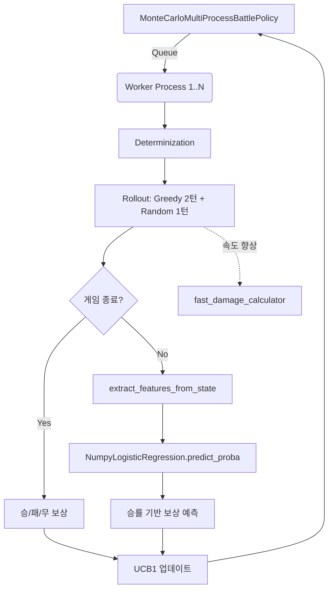

# 🔍 submission (Yamabuki) 분석 보고서

> **제출자:** Masatoshi Hidaka  
> **분석일:** 2026-05-14  
> **파일 수:** 21개 (ML 모델 파일 및 개발용 스크립트 포함)  
> **총 코드량:** 방대함 (핵심 파일 약 1,500줄 이상)  
> **특징:** **MCTS (다완 반디트) 기반** + **멀티프로세싱 병렬화** + **로지스틱 회귀 머신러닝 평가 모델** + **자체 최적화 데미지 계산기**

---

## 1. 코드 구조 개요

이 제출물("Yamabuki")은 대회 출품작 중 **가장 학술적이고 기술적으로 고도화된 접근**을 보여줍니다. 다른 팀들과 달리 팀빌딩/선택 정책은 포기(Random)하고, 오직 **배틀 정책의 성능을 극대화**하는 데 모든 자원을 집중했습니다.

```
submission/
├── README.md                                  # 상세한 전략 설명 (영어/일어)
├── competitor.py                              # Yamabuki Competitor
├── monte_carlo_multi_process_battle_policy.py # ⭐ 핵심: 멀티프로세스 MCTS 배틀 정책
├── fast_damage_calculator.py                  # ⭐ 속도 최적화 커스텀 데미지 계산기
├── feature_extraction.py                      # ⭐ ML 모델용 164차원 특징 추출기
├── numpy_inference.py                         # ⭐ 의존성 제거용 순수 NumPy ML 추론기
├── evaluation_model_numpy.pkl                 # 사전 학습된 머신러닝 가중치
└── (그 외 각종 학습, 수집, 평가용 스크립트)
```

### 클래스/아키텍처 다이어그램



---

## 2. 배틀 정책 (`MonteCarloMultiProcessBattlePolicy`)

가장 핵심적인 부분으로, 제한 시간(500ms) 내에 **MCTS(Monte Carlo Tree Search)의 UCB1 알고리즘**을 사용하여 최적의 수를 탐색합니다.

### 2.1 다완 반디트(Multi-Armed Bandit) 롤아웃 설계

1회의 롤아웃(Simulation)은 다음과 같이 구성됩니다:
1. **첫 턴:** 평가하고자 하는 행동(Action) 수행, 상대는 Greedy로 대응
2. **이후 2턴 (`rollout_turns_greedy`):** 양측 모두 Greedy 정책으로 시뮬레이션
3. **이후 1턴 (`rollout_turns_random`):** 양측 모두 Random 정책으로 시뮬레이션
4. **종료 조건:** 위 턴 진행 후 승패가 났다면 `1.0` / `-1.0` 보상
5. **승패가 안 났다면 (대부분의 경우):** 현재 상태를 **머신러닝 평가 모델(Evaluation Model)**에 넘겨 승률을 예측 (0.0 ~ 1.0)하여 보상으로 환산

### 2.2 멀티프로세싱 병렬화 (Multiprocessing)

Python의 GIL(Global Interpreter Lock) 한계를 극복하기 위해 `multiprocessing.Process`와 `Queue`를 사용해 여러 코어에서 롤아웃을 동시에 실행합니다. 제한 시간 내에 탐색 노드(Visit Count)를 폭발적으로 늘려 MCTS의 정확도를 높였습니다.

### 2.3 커스텀 데미지 계산기 (`fast_damage_calculator.py`)

Greedy 시뮬레이션이 롤아웃의 병목(Bottleneck)이 되는 것을 발견하고, 엔진의 `calculate_damage`를 직접 재작성했습니다.
- 반복문 대신 사전 계산된 딕셔너리(`_CATEGORY_TO_ATTACK_STAT` 등) 사용
- 함수 호출 오버헤드를 줄이기 위해 수식 인라인화(Inlining)
- 불필요한 객체 생성 억제

> **분석:** Pure Python 환경에서 허용 가능한 한계치까지 속도 최적화를 이뤄낸 장인정신이 돋보입니다.

---

## 3. 머신러닝 평가 모델 (`numpy_inference.py` & `feature_extraction.py`)

롤아웃 끝까지 시뮬레이션하기에는 턴이 너무 길어지므로, 3턴 뒤의 **판세(State)를 보고 누가 이길지 예측하는 AI**를 학습시켜 탑재했습니다.

### 3.1 164차원 특징 추출 (Feature Extraction)
현재 배틀 상태를 164개의 실수값(float32) 배열로 변환합니다.
- **포켓몬 정보 (양측 12마리):** HP 비율, 상태이상(One-hot 7개), 랭크업 수치(7개), 방어 여부, 기절 여부
- **사이드 상태:** 리플렉터, 빛의장막, 순풍, 스텔스록, 독압정
- **글로벌 상태:** 날씨(8개), 지형(5개), 트릭룸 여부

### 3.2 NumPy Only 의존성 회피 추론
외부 라이브러리(scikit-learn 등) 설치를 요구할 수 없는 대회 규정을 우회하기 위해, 로지스틱 회귀(Logistic Regression)의 가중치(`coef_`, `intercept_`)만 피클링하여 가져온 뒤, 순수 `NumPy` 연산(`X @ coef + intercept`)과 `sigmoid` 함수만으로 자체 추론기를 구현했습니다.

---

## 4. 선택 및 팀빌드 정책

```python
self.__selection_policy = RandomSelectionPolicy()
self.__team_build_policy = RandomTeamBuildPolicy()
```

> **선택과 집중:** 배틀 정책을 극강으로 깎은 대신, 팀 빌딩과 선택 로직은 **완전한 무작위(Random)**로 두었습니다. 이는 AI의 유연성을 뽐낼 수는 있으나 대회 성적에는 매우 치명적인 도박입니다.

---

## 5. 전략 종합 평가

### 5.1 장점

| 장점 | 설명 |
|---|---|
| **최고 수준의 배틀 알고리즘** | UCB1 다완 반디트 + 멀티프로세싱 기반 탐색 |
| **머신러닝 정적 평가** | 턴 끝까지 보지 않고 164차원 특징으로 판세의 유불리를 머신러닝으로 판단 |
| **엔진 한계 극복** | 속도를 위해 핵심 계산기를 직접 최적화 재구현 (`fast_damage_calculator`) |
| **규정 회피 기술력** | scikit-learn 없이 작동하는 순수 NumPy 행렬곱 추론기 구현 |

### 5.2 약점

| 약점 | 심각도 | 설명 |
|---|---|---|
| **팀/선택 정책 부재** | 🔴 **매우 심각** | 완전 랜덤한 파티와 노력치로 배틀에 임함 → 배틀 AI가 아무리 뛰어나도 "체급"의 한계를 극복하기 불가능함 |
| **높은 연산 오버헤드** | 🟡 중간 | 멀티프로세싱 통신(Queue) 및 상태 복사(Determinization)가 많은 리소스 차지 |

---

## 6. 결론 및 엔진 개발에 주는 시사점

**Yamabuki (Masatoshi Hidaka)**는 배틀 로직의 "끝판왕"을 보여줍니다. 다른 팀들이 휴리스틱이나 단순 트리 탐색에 머물렀다면, 이 팀은 프로기보 학습(Feature Extraction + ML)과 병렬 연산을 통한 딥러닝 체스/바둑 AI에 가까운 접근을 시도했습니다.

**하지만 완전 랜덤 팀 빌딩은 뼈아픈 실책입니다.** 대회 룰상 아무리 똑똑하게 플레이하더라도 "공격 종족값 10, 체력 10" 같은 랜덤 포켓몬으로 잘 짜인 상대 팀을 이기는 것은 불가능합니다.

**💡 향후 VGC 엔진(pokemon-vgc-engine) 개발을 위한 핵심 시사점:**
1. **성능 병목 인지:** 이 제출물에서 `fast_damage_calculator.py`를 굳이 만든 이유는 기존 VGC 엔진의 `calculate_damage`가 MCTS 같은 대규모 시뮬레이션 시 병목이 되기 때문입니다. 엔진 개발 시 이 최적화 기법(사전 딕셔너리, 인라인화)을 엔진 코어에 도입하는 것을 강력히 추천합니다.
2. **머신러닝 기반 State 평가 로직 도입:** 164차원의 Feature 구조를 참고하면 차세대 배틀 AI 개발에 큰 도움이 됩니다.

---
**최종 요약:** 배틀 정책의 완성도는 독보적 1위(ML 평가 + 멀티프로세싱 + 커스텀 엔진 최적화). 그러나 랜덤 팀빌딩으로 인해 스스로 발목을 잡은 비운의 마스터피스.
