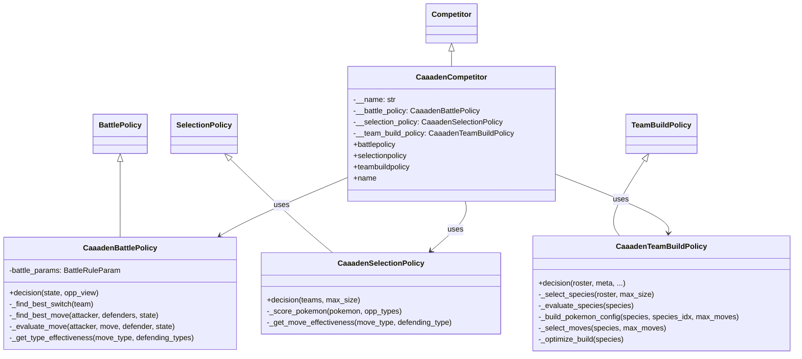
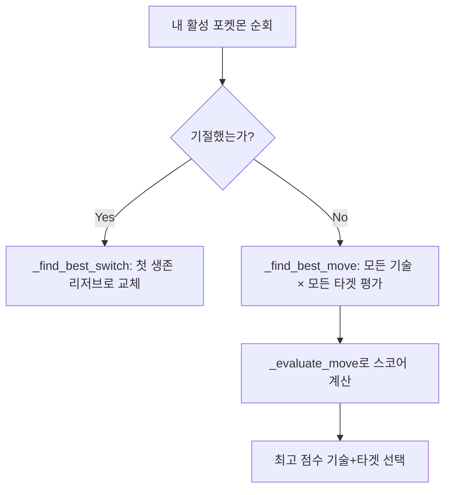

# 🔍 caaaden_competitor 분석 보고서

> **제출자:** Caaaden  
> **분석일:** 2026-05-14  
> **파일 수:** 3개 (Python 2 + README 1)  
> **특징:** 단일 파일에 모든 정책 구현, 순수 휴리스틱 기반

---

## 1. 코드 구조 개요

```
caaaden_competitor/
├── main.py                  # 진입점 (서버 연결)
├── caaaden_competitor.py    # 모든 정책 + Competitor 클래스 (단일 파일, 326줄)
└── README.md                # 실행 안내
```

### 클래스 다이어그램



---

## 2. 각 정책 상세 분석

### 2.1 `CaaadenTeamBuildPolicy` — 팀 빌드 전략

가장 정교한 부분. **3단계 파이프라인**으로 팀을 구성한다.

#### Step 1: 종족 평가 (`_evaluate_species`)

**스코어링 공식:**
```
score = base_stat_total
      + (듀얼타입이면 +50)
      + Σ(기술.base_power × 0.5)
      + (상태이상 기술 보유 시 +30/개)
      + (선제기 보유 시 +40/개)
```

| 평가 요소 | 가중치 | 의도 |
|---|---|---|
| 베이스 스탯 총합 | +1 (절대값) | 기본 전투력 |
| 듀얼 타입 | +50 | 타입 커버리지 확장 |
| 기술 위력 | +0.5/bp | 강한 기술 보유 선호 |
| 상태이상 기술 | +30/개 | 유틸리티 가치 |
| 선제기 | +40/개 | 선공권 확보 |

#### Step 2: 타입 다양성 기반 선택 (`_select_species`)

```python
# 앞 2마리는 점수순 무조건 선택
# 3마리부터는 기존 선택과 타입이 안 겹치는 종족만 선택
if len(selected) < 2 or len(species_types & used_types) == 0:
    selected.append(idx)
```

- 처음 2마리는 순수 점수 기반
- 3마리째부터는 **이미 선택된 타입과 겹치지 않는 포켓몬만** 추가
- 다양성 조건으로 `max_size`를 못 채우면 남은 슬롯은 점수순으로 채움

#### Step 3: 포켓몬 빌드 최적화 (`_build_pokemon_config`, `_optimize_build`)

**역할 기반 EV/Nature 배분:**

| 조건 | 역할 | Nature | EV 배분 |
|---|---|---|---|
| 공격 ≥ 100 & 스피드 ≥ 90 & 물리 > 특수 | 물리 어태커 | ADAMANT (공↑ 특공↓) | HP 6 / 공격 252 / 스피드 252 |
| 공격 ≥ 100 & 스피드 ≥ 90 & 특수 > 물리 | 특수 어태커 | MODEST (특공↑ 공↓) | HP 6 / 특공 252 / 스피드 252 |
| 방어계 ≥ 100 | 탱커 | BOLD (방↑ 공↓) | HP 252 / 방어 252 / 특방 6 |
| 그 외 | 밸런스 | SERIOUS (무보정) | 올 85 균등 배분 |

> **주목:** Botzilla와 달리 EV/Nature를 **랜덤이 아닌 역할 기반으로** 배분한다.

#### 기술 선택 (`_select_moves`)

**기술 스코어링 공식:**
```
score = base_power × 2
      + accuracy × 100
      + max_pp × 5
      + (선제기면 +150)
      + (상태이상 기술이면 +100)
      + (능력치 변화 기술이면 +80)
      + (자속 보너스: STAB이면 +100)
```

- `accuracy × 100`이 매우 큰 비중 → 명중률이 높은 기술을 강하게 선호
- 자속 보너스(STAB)를 기술 선택 단계에서 이미 고려
- 최대 4개까지 선택

### 2.2 `CaaadenSelectionPolicy` — 포켓몬 선택 전략

**상대 팀의 타입을 분석하여** 유리한 포켓몬을 선택하는 **카운터픽 전략.**

**스코어링 공식:**
```
score = Σ(stats[1:6]) × 0.1    # 공/방/특공/특방/스피드
      + stats[0] × 0.05         # HP (낮은 가중치)
      + (약점 찌르는 기술 보유 시 +200/개)  # ×2 이상 효과
      + (유리한 기술 보유 시 +100/개)       # ×1.5 이상 효과
      + (타입 저항 시 +150)                 # 상대 기술에 ×0.5 이하
```

| 요소 | 가중치 | 의도 |
|---|---|---|
| 전투 스탯 (공/방/특공/특방/스피드) | ×0.1 | 기본 전투력 (비교적 낮은 비중) |
| HP | ×0.05 | 생존력 (더 낮은 비중) |
| 약점 찌르기 (×2+) | +200/기술 | **공격적 상성 우위 최우선** |
| 유리 기술 (×1.5+) | +100/기술 | 보조적 상성 우위 |
| 방어 저항 (×0.5-) | +150/타입 | 방어적 상성 우위 |

> **핵심:** 스탯보다 **상대 타입에 대한 상성 우위**가 선택의 핵심 기준

### 2.3 `CaaadenBattlePolicy` — 배틀 전략

**데미지 계산 기반 탐욕(Greedy) 전략 + 보너스 시스템.**

#### 행동 결정 흐름



#### 기술 평가 (`_evaluate_move`)

**스코어링 공식:**
```
score = calculate_damage(...)     # 엔진의 실제 데미지 계산 함수 사용
      + (KO 가능하면 +1000)       # 처치 가능 시 최우선
score *= type_effectiveness       # 타입 배율 곱셈
      + (선제기면 +100)           # 선공 보너스
```

| 평가 요소 | 방식 | 특징 |
|---|---|---|
| 데미지 | `calculate_damage()` 엔진 함수 직접 호출 | 정확한 데미지 계산 |
| KO 보너스 | 데미지 ≥ 상대 HP면 +1000 | 처치 가능 행동 최우선 |
| 타입 상성 | `DAMAGE_MULTIPLICATION_ARRAY` 직접 참조 | 정확한 상성 계산 |
| 선제기 | priority > 0이면 +100 | 선공 가치 반영 |
| 예외 처리 | Exception 시 `base_power` 반환 | 안전장치 |

#### 교체 전략 (`_find_best_switch`)

- **단순 방식:** 리저브에서 **첫 번째 생존 포켓몬**으로 교체
- 상대 타입 상성이나 유리한 매치업 고려 없음
- **개선 여지가 가장 큰 부분**

---

## 3. 전략 종합 평가

### 3.1 전체 전략 요약

| 단계 | 전략 | 접근법 |
|---|---|---|
| **팀 빌드** | 스탯+기술 기반 평가 → 타입 다양성 선택 → 역할별 EV/Nature 배분 | ✅ 체계적 |
| **선택** | 상대 팀 타입 분석 → 카운터픽 | ✅ 적응적 |
| **배틀** | 데미지 계산 + KO/선제기 보너스 | ✅ 정확하나 단순 |

### 3.2 전략 철학

- **"정석 플레이" 스타일:** 타입 상성과 데미지 계산이라는 포켓몬 배틀의 기본기를 충실히 구현
- 머신러닝이나 복잡한 알고리즘 없이 **순수 휴리스틱**으로 모든 결정
- 팀 빌드 단계에서 역할 분담(어태커/탱커/밸런스)까지 고려하는 세심함

### 3.3 장점

| 장점 | 설명 |
|---|---|
| **역할 기반 EV/Nature** | 포켓몬의 스탯 분포를 분석하여 적절한 빌드 자동 결정 — 다른 제출물 대비 우수 |
| **카운터픽 선택** | 상대 팀을 분석하고 공격/방어 상성 모두 고려하여 선택 |
| **정확한 데미지 계산** | `calculate_damage()` 엔진 함수를 직접 호출하여 정밀 평가 |
| **기술 선택 최적화** | STAB, 명중률, PP, 선제기, 상태이상 등 다각도로 기술 평가 |
| **예외 안전** | 배틀 정책에서 try-except로 폴백, 안정적 동작 |
| **코드 정리** | 주석이 한국어로 잘 작성되어 있고, 함수 분리가 깔끔 |

### 3.4 약점

| 약점 | 심각도 | 설명 |
|---|---|---|
| 교체 전략 부재 | 🟡 중간 | 기절 시에만 교체, 불리한 매치업에서 자발적 교체 없음 |
| 교체 대상 단순 | 🟡 중간 | 첫 번째 생존 리저브로 교체, 상성 고려 없음 |
| `BattleRuleParam()` 반복 생성 | 🟠 낮음 | SelectionPolicy에서 루프마다 새로 생성 — 성능 비효율 |
| 메타 정보 미활용 | 🟡 중간 | `meta` 파라미터를 팀빌드에서 사용하지 않음 |
| 밸런스형 EV 배분 비효율 | 🟠 낮음 | 올 85 배분은 어중간 — 특정 역할에 집중하는 것이 유리 |
| 장기적 전략 부재 | 🟡 중간 | 매 턴 최선만 선택, HP 관리나 교체 타이밍 미고려 |

---

## 4. Botzilla와 비교

| 비교 항목 | Botzilla | Caaaden |
|---|---|---|
| **접근법** | 강화학습 (Q-Learning) 시도 | 순수 휴리스틱 |
| **팀빌드 EV/Nature** | 랜덤 | ✅ 역할 기반 최적화 |
| **기술 선택** | 랜덤 | ✅ 다요소 스코어링 |
| **선택 정책** | 타입 다양성 + 스탯 | 상대 분석 카운터픽 |
| **배틀 정책** | Greedy 폴백 (버그) | 데미지 계산 + KO/선제기 보너스 |
| **교체 전략** | 없음 | 기절 시에만 (단순) |
| **코드량** | 약 300줄 (5파일) | 326줄 (1파일) |
| **외부 의존** | numpy, joblib, 42MB Q-Table | 없음 (엔진만 사용) |

---

## 5. 결론

Caaaden은 **머신러닝 없이 순수 도메인 지식(포켓몬 메카닉)만으로** 탄탄한 AI를 구현했습니다. 특히 **팀 빌드 단계**에서 역할 판별 → EV/Nature 최적화 → 기술 선택까지 이어지는 파이프라인이 잘 설계되어 있고, **선택 정책**에서 상대 팀을 분석하는 카운터픽 전략이 돋보입니다. 배틀 정책은 엔진의 `calculate_damage()`를 직접 활용하여 정확하지만, 자발적 교체 전략이 없어 불리한 매치업에서의 대응이 약할 수 있습니다.

전체적으로 **기본기에 충실한 정석 플레이어** 스타일의 AI입니다.
