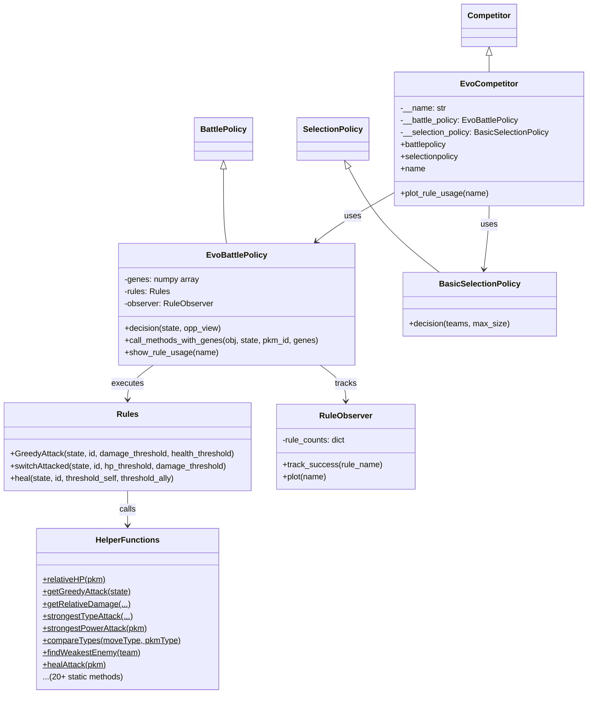
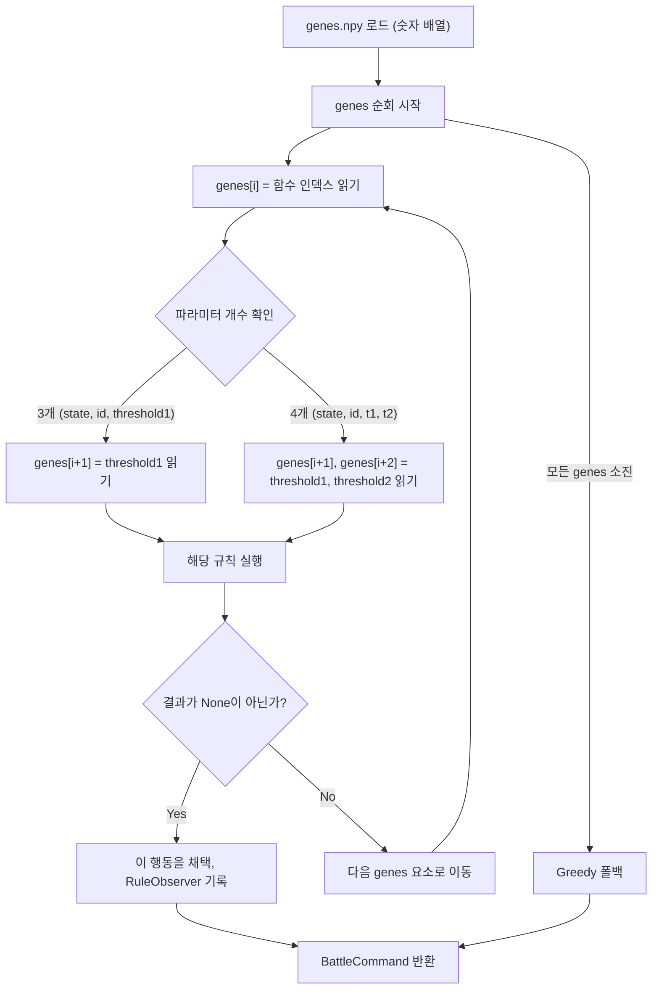

# 🔍 evoTrainer 분석 보고서

> **제출자:** Milan Tóth (milannal1m)  
> **분석일:** 2026-05-14  
> **파일 수:** 8개 Python 파일 + genes.npy + README + LICENSE + requirements.txt  
> **특징:** 진화 알고리즘(Evolutionary Algorithm)으로 학습된 규칙 기반 AI

---

## 1. 코드 구조 개요

```
evoTrainer/
├── main.py                  # 진입점 (서버 연결)
├── EvoCompetitor.py         # Competitor 클래스 (정책 조립)
├── EvoBattlePolicy.py       # 배틀 정책 (유전자 기반 규칙 실행)
├── EvoSelectionPolicy.py    # 선택 정책 (기본 순서)
├── Rules.py                 # 규칙 정의 (3개 규칙)
├── HelperFunctions.py       # 전투 분석 유틸리티 (366줄, 핵심)
├── RuleObserver.py          # 규칙 사용 통계 추적/시각화
├── test_match.py            # 자체 대전 테스트
├── genes.npy                # 진화 알고리즘으로 학습된 유전자 (394 bytes)
├── requirements.txt         # 의존성 (numpy)
├── README.md                # 프로젝트 설명
└── LICENSE                  # MIT License
```

### 클래스 다이어그램



---

## 2. 핵심 메커니즘: 유전자 기반 규칙 실행

### 2.1 유전자(Genes)란?

`genes.npy`는 **진화 알고리즘(EA)**으로 사전 학습된 숫자 배열입니다. 이 배열이 **어떤 규칙을 어떤 순서로, 어떤 임계값으로 실행할지**를 결정합니다.

### 2.2 유전자 디코딩 흐름



**핵심 아이디어:** 유전자 배열이 **규칙의 실행 순서와 임계값**을 인코딩합니다. 첫 번째로 유효한 결과를 반환하는 규칙이 채택됩니다.

### 2.3 유전자 인코딩 형식

```
genes = [func_idx, threshold1, threshold2, func_idx, threshold1, threshold2, ...]
```

- `func_idx`: Rules 클래스의 public 메서드 인덱스 (0, 1, 2 = GreedyAttack, switchAttacked, heal)
- `threshold1`, `threshold2`: 해당 규칙의 조건 임계값 (진화 알고리즘이 최적화)

---

## 3. 각 규칙 상세 분석

### 3.1 `Rules.GreedyAttack` — 조건부 탐욕 공격

```python
def GreedyAttack(self, state, id, damage_threshold, health_threshold):
```

| 조건 | 설명 |
|---|---|
| `relative_damage > damage_threshold` | 예상 데미지가 임계값 초과 |
| `relativeHP(pkm) > health_threshold` | 내 HP 비율이 임계값 초과 |

- 두 조건 **모두 충족**해야 Greedy 공격 실행
- Greedy 공격 = 엔진의 `greedy_double_battle_decision` 결과
- **의미:** "내가 충분히 건강하고, 충분한 데미지를 줄 수 있을 때만 공격"

### 3.2 `Rules.switchAttacked` — 불리한 매치업 교체

```python
def switchAttacked(self, state, id, hp_threshold, damage_threshold):
```

**동작 흐름:**
1. 상대 시점에서 Greedy 공격을 시뮬레이션 (state를 뒤집어서)
2. 상대가 나에게 줄 수 있는 데미지 계산
3. **교체 조건:** 내 HP < `hp_threshold` **또는** 받을 데미지 > `damage_threshold`
4. 리저브 중에서 상대 공격에 덜 취약한 포켓몬으로 교체
5. **교체 대상 조건:** HP > `hp_threshold` **그리고** 받을 데미지 < `damage_threshold`

> **주목:** 다른 제출물과 달리 **상대의 공격을 시뮬레이션하여** 교체 결정 — 매우 고급 전략

### 3.3 `Rules.heal` — 조건부 힐

```python
def heal(self, state, id, threshold_self, threshold_ally):
```

| 조건 | 설명 |
|---|---|
| `relativeHP(pkm0) < threshold_self` | 내 HP가 낮을 때 |
| `relativeHP(pkm1) < threshold_ally` | 파트너 HP가 낮을 때 |

- 더블배틀에서 자신 또는 파트너 중 HP가 낮은 쪽에 힐 사용
- 힐 기술이 없으면 `None` 반환 → 다음 규칙으로 넘어감

---

## 4. HelperFunctions 주요 유틸리티 (366줄)

가장 방대한 파일. 전투 분석을 위한 20개 이상의 static 메서드 제공.

| 함수 | 역할 |
|---|---|
| `relativeHP(pkm)` | HP / MAX_HP 비율 계산 |
| `getRelativeDamage(...)` | 데미지 / 3000 으로 정규화 |
| `getGreedyAttack(state)` | 엔진의 Greedy 결정 호출 |
| `getGreedyDamageAgainstPokemon(...)` | **상대 시점에서** 나에게 올 데미지 시뮬레이션 |
| `compareTypes(moveType, pkmType)` | 타입 상성 배율 조회 |
| `strongestTypeAttack(pkm, enemies)` | 타입 상성 최적 공격 찾기 |
| `strongestPowerAttack(pkm)` | 최고 위력 기술 찾기 |
| `strongestPhysicalAttack(...)` | 물리 최강 기술 + 물방 약한 적 타겟 |
| `strongestSpecialAttack(...)` | 특수 최강 기술 + 특방 약한 적 타겟 |
| `strongestWeatherAttack(...)` | 날씨 부스트 받는 기술 찾기 |
| `healAttack(pkm)` | 힐 기술 인덱스 찾기 |
| `findWeakestEnemy(team)` | HP 가장 낮은 적 찾기 |
| `findTypeWeaknesses(...)` | 적 기술 대비 내 타입 약점 분석 |
| `compareWeatherType(pkm, state)` | 날씨 방어 보너스 체크 (모래/눈) |
| `getTerrainAdvantage(...)` | 필드 효과 이점 계산 |
| `getPrioAdvantage(...)` | 우선도/트릭룸 이점 계산 |
| `relativeStat(statid, pkm)` | 이론적 최대치 대비 스탯 비율 |
| `noNegativeEffect(team)` | 상태이상 없는 포켓몬 찾기 |

> **주목:** 날씨, 필드, 트릭룸, 우선도까지 고려하는 함수들이 준비되어 있으나, 현재 Rules에서 직접 사용하는 것은 일부뿐

---

## 5. 선택/팀빌드 정책

### 5.1 `BasicSelectionPolicy` (실제 사용)

```python
def decision(self, teams, max_size):
    return list(set(range(len(teams[0].members))))[:max_size]
```

- **인덱스 순서대로** 단순 선택
- 상대 분석이나 전략적 선택 없음

### 5.2 팀빌드 정책

- **TeamBuildPolicy 없음** — `teambuildpolicy` 프로퍼티가 Competitor에 정의되지 않음
- 엔진 기본값 사용 (아마 랜덤 또는 기본 팀빌드)

---

## 6. RuleObserver — 규칙 사용 추적

- 각 규칙이 성공적으로 적용될 때마다 카운트
- `matplotlib`로 수평 막대 그래프 생성
- 학습/디버깅용 도구 — 어떤 규칙이 주로 활성화되는지 시각화

---

## 7. 전략 종합 평가

### 7.1 전체 전략 요약

| 단계 | 전략 | 접근법 |
|---|---|---|
| **팀 빌드** | 없음 (엔진 기본값) | ❌ 미구현 |
| **선택** | 인덱스 순서 | ❌ 전략 없음 |
| **배틀** | 유전자 인코딩된 규칙 순차 실행 → Greedy 폴백 | ✅ 독창적 |

### 7.2 전략 철학

- **"진화된 전술가" 스타일:** 규칙의 실행 순서와 임계값을 진화 알고리즘(EA)으로 최적화
- 사람이 규칙(공격/교체/힐)을 설계하고, **EA가 "언제" 각 규칙을 적용할지**를 학습
- 클래식한 **Rule-based System + Evolutionary Optimization** 하이브리드

### 7.3 장점

| 장점 | 설명 |
|---|---|
| **독창적 아키텍처** | 유전자 기반 규칙 실행은 다른 제출물에 없는 고유한 접근 |
| **상대 공격 시뮬레이션** | `switchAttacked`에서 상대 시점의 데미지를 예측하여 교체 결정 |
| **조건부 교체** | 불리한 매치업을 감지하고 유리한 포켓몬으로 교체 — 고급 전략 |
| **힐 전략** | 더블배틀에서 파트너 힐까지 고려 |
| **풍부한 유틸리티** | 날씨/필드/트릭룸/우선도 분석 함수 완비 |
| **관측 도구** | RuleObserver로 전략 동작을 시각화/분석 가능 |
| **학습 가능** | genes.npy를 교체하면 다른 전략 가능 — 확장성 우수 |

### 7.4 약점

| 약점 | 심각도 | 설명 |
|---|---|---|
| 팀빌드 정책 없음 | 🔴 **치명적** | TeamBuildPolicy 미구현 — 엔진 기본값에 의존 |
| 선택 정책 단순 | 🟡 중간 | 상대 분석 없이 인덱스 순서 선택 |
| 규칙 수 부족 | 🟡 중간 | 3개 규칙만 존재 — HelperFunctions의 풍부한 유틸리티 미활용 |
| genes.npy 불투명 | 🟠 낮음 | 학습 결과의 해석이 어려움 |
| `BattleRuleParam()` 반복 생성 | 🟠 낮음 | HelperFunctions 곳곳에서 매번 새로 생성 |
| 독일어/영어 혼용 주석 | 🟠 낮음 | 가독성 다소 저하 |

---

## 8. 이전 제출물과 비교

| 비교 항목 | Botzilla | Caaaden | evoTrainer |
|---|---|---|---|
| **접근법** | Q-Learning (버그) | 순수 휴리스틱 | 규칙 + 진화 알고리즘 |
| **팀빌드** | 스탯 기반 | 역할별 EV/Nature 최적화 | ❌ 미구현 |
| **선택** | 타입 다양성 | 카운터픽 | 단순 순서 |
| **배틀** | Greedy 폴백 | 데미지+KO+선제기 | 유전자 기반 조건부 규칙 |
| **교체 전략** | 없음 | 기절 시에만 | ✅ **불리 매치업 자발적 교체** |
| **힐 전략** | 없음 | 없음 | ✅ 자신+파트너 힐 |
| **독창성** | 중간 | 낮음 (정석) | ✅ **높음** |
| **코드량** | ~300줄 (5파일) | 326줄 (1파일) | ~550줄 (8파일) |

---

## 9. 결론

evoTrainer는 가장 **독창적인 접근법**을 사용한 제출물입니다. 사람이 설계한 규칙(공격/교체/힐)에 **진화 알고리즘으로 최적화된 실행 순서와 임계값**을 결합하여, 상황에 맞는 행동을 자동으로 선택합니다. 특히 **상대 공격 시뮬레이션 기반 교체 전략**은 다른 제출물에는 없는 고급 기능입니다.

그러나 **팀빌드와 선택 단계가 사실상 미구현**이라는 치명적 약점이 있어, 아무리 좋은 배틀 전략이 있어도 부적합한 팀 구성/선택으로 인해 전투 전에 이미 불리한 상황에 놓일 수 있습니다. HelperFunctions에 날씨, 필드, 트릭룸 등 풍부한 분석 함수가 준비되어 있지만 Rules에서 3개만 활용하는 것도 아쉬운 점입니다.

**한 줄 요약:** 배틀 AI의 설계 철학은 가장 흥미롭지만, 팀빌드/선택의 부재가 전체 경쟁력을 크게 제한한다.
