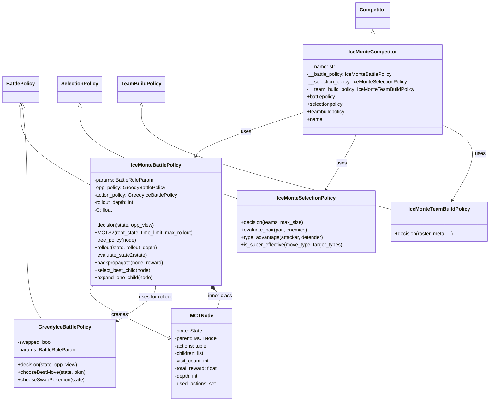
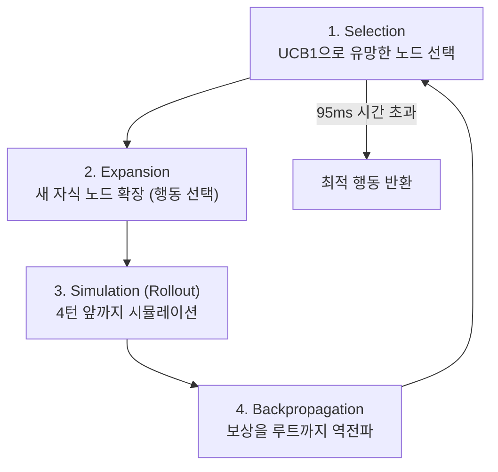
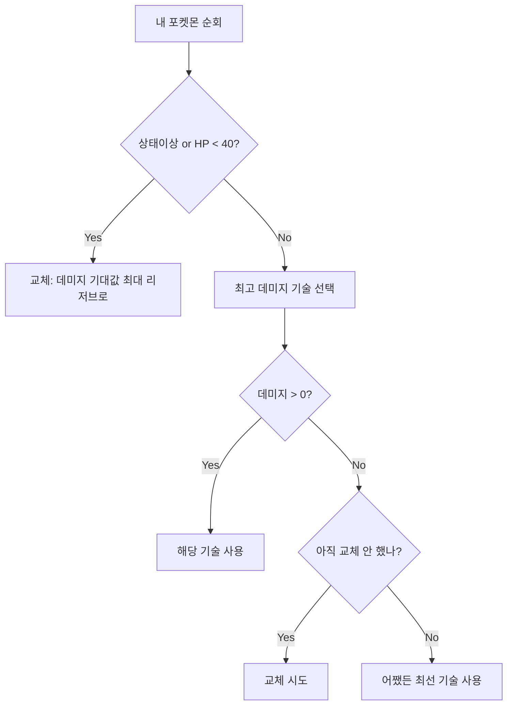

# 🔍 iceMonteSubmission 분석 보고서

> **제출자:** IceMonte  
> **분석일:** 2026-05-14  
> **파일 수:** 6개 Python 파일  
> **특징:** **Monte Carlo Tree Search (MCTS)** 기반 배틀 AI — 대회 참가자 중 가장 고급 탐색 알고리즘 사용

---

## 1. 코드 구조 개요

```
iceMonteSubmission/
├── main.py                      # 진입점 (서버 연결)
├── iceMonteCompetitor.py        # Competitor 클래스 (정책 조립)
├── iceMonteTeamBuildPolicy.py   # 팀 빌드 (역할 분석 + 조합 탐색)
├── iceMonteSelectionPolicy.py   # 선택 (조합 평가 + 카운터픽)
├── iceMonteBattlePolicy.py      # 배틀 (⭐ MCTS 핵심, 340줄)
└── greedyBattlePolicy.py        # 커스텀 Greedy 정책 (MCTS 내부용)
```

### 클래스 다이어그램



---

## 2. 핵심 메커니즘: Monte Carlo Tree Search (MCTS)

### 2.1 MCTS란?

알파고(AlphaGo)에서 사용한 것으로 유명한 탐색 알고리즘. **미래 게임 상태를 시뮬레이션**하여 최적의 행동을 찾는다.

### 2.2 MCTS 4단계 사이클



### 2.3 구현 상세

#### 시간 제한: **95ms**
```python
actions = self.MCTS2(state, 95)  # 95ms 안에 가능한 만큼 반복
```

#### UCB1 공식 (탐색-활용 균형)
```
UCB1 = Q/N + C × √(ln(N_parent) / N)
```

| 기호 | 의미 | 값 |
|---|---|---|
| Q | 누적 보상 | 시뮬레이션 결과 합계 |
| N | 방문 횟수 | 해당 노드 |
| N_parent | 부모 방문 횟수 | 부모 노드 |
| C | 탐색 계수 | **동적:** 1.41 (일반) / 10.0 (위기) |

#### 적응적 탐색 깊이
```python
if reward < -600:          # 크게 불리한 상황
    self.C = 10.0          # 탐색 강화 (더 많은 가능성 탐색)
    self.rollout_depth *= 2  # 더 깊이 시뮬레이션
else:                       # 일반 상황
    self.C = 1.41
    self.rollout_depth = 4   # 기본 4턴 시뮬레이션
```

> **주목:** 불리한 상황에서 탐색 범위와 깊이를 동시에 늘림 — 역전 가능성을 더 넓게 탐색

### 2.4 롤아웃 전략 (상황 적응형)

```python
if evaluate_state2(state) < 0:     # 불리한 상황
    60% 확률 → 랜덤 행동 (탐색)
    40% 확률 → Greedy 행동 (활용)
else:                               # 유리한 상황
    20% 확률 → 랜덤 행동
    80% 확률 → Greedy 행동 (안정적 플레이)
```

- **불리할 때:** 랜덤 비율을 높여 역전 경로 탐색
- **유리할 때:** Greedy 비율을 높여 안정적 승리 추구

### 2.5 상대 기술 추론 (`_deduce_moves`)

```python
def _deduce_moves(self, pokemon, max_moves):
    # 상대 포켓몬의 알려진 기술이 4개 미만이면
    # 해당 종족이 배울 수 있는 기술 중 랜덤으로 채워넣음
```

> **주목:** 상대의 미공개 기술을 **종족 학습 기술 풀에서 샘플링하여 추정** — 불완전 정보 대응

---

## 3. 상태 평가 함수 (`evaluate_state2`)

MCTS의 핵심 — 게임 상태의 유불리를 점수화.

**평가 공식:**
```
own_score  = 50 × Σ(내 HP비율) + 400 × (4 - 적 생존수) + 300 × 내 활성 수 + 100 × 내 리저브 수
           + Σ(내 스피드) + 20 × Σ(내 랭크업) + 100 × Σ(적 상태이상 점수)
           
enemy_score = (동일 구조로 적 관점에서 계산)

최종 보상 = own_score - enemy_score
```

| 평가 요소 | 가중치 | 의도 |
|---|---|---|
| HP 비율 합 | ×50 | 생존력 평가 |
| 적 처치 수 (4 - 적 생존) | ×400 | **KO가 가장 높은 가치** |
| 활성 포켓몬 수 | ×300 | 필드 위 전력 |
| 리저브 포켓몬 수 | ×100 | 교체 자원 |
| 스피드 스탯 | ×1 | 선공 이점 |
| 랭크업 합계 | ×20 | 버프/디버프 가치 |
| 상태이상 점수 | ×100 | 적에 건 상태이상 가치 |

**상태이상 점수 테이블:**

| 상태이상 | 점수 |
|---|---|
| FROZEN | 20 (최고) |
| SLEEP | 15 |
| TOXIC | 15 |
| BURN | 10 |
| PARALYZED | 10 |
| POISON | 5 |
| NONE | 0 |

**엔드게임 보정:** 양측 합계 2마리 이하면 점수 ×0.8 → 역전 가능성 반영

---

## 4. 커스텀 Greedy 정책 (`GreedyIceBattlePolicy`)

MCTS 내부의 롤아웃과 기본 행동 선택에 사용되는 **강화된 Greedy 정책.**

### 행동 결정 우선순위



**교체 대상 선택 (`chooseSwapPokemon`):**
- 리저브의 모든 포켓몬에 대해 적 활성 포켓몬에 줄 수 있는 **총 데미지 합**을 계산
- 가장 높은 데미지 기대값을 가진 리저브로 교체

> **Caaaden과 차이:** 상태이상에 걸리면 **자발적 교체** + 교체 대상도 **데미지 기대값 기반**

---

## 5. 팀 빌드 정책 (`IceMonteTeamBuildPolicy`)

### 5.1 역할 분석 (`analyze_pokemon`)

각 포켓몬을 스탯과 기술로 분석하여 **역할 태그**를 부여:

| 역할 | 조건 |
|---|---|
| `physical_attacker` | 공격 > 특공 & 공격 > 100 |
| `special_attacker` | 특공 > 공격 & 특공 > 100 |
| `fast` | 스피드 > 100 |
| `priority_user` | 선제기 보유 |
| `healer` / `support` | 회복 기술 보유 |
| `speed_control` | 트릭룸 or 순풍 보유 |
| `screen_support` | 리플렉트 or 빛의장막 보유 |
| `hazard_setter` | 설치기 보유 |
| `status_spreader` | 상태이상 기술 보유 |
| `switcher` | 강제교체 기술 보유 |
| `disruptor` | 기타 비공격 기술 보유 |

### 5.2 팀 조합 탐색 (`select_strong_team`)

**팀 스코어 공식:**
```
score = len(types) × 0.5 + len(roles) × 1.0 + len(coverage) × 0.3
```

| 요소 | 가중치 | 의도 |
|---|---|---|
| 타입 다양성 | ×0.5 | 방어적 커버리지 |
| 역할 다양성 | ×1.0 | **가장 중요 — 다양한 역할 분담** |
| 기술 타입 커버리지 | ×0.3 | 공격적 커버리지 |

**탐색 방식:**
- `itertools.combinations`로 **모든 6마리 조합을 전수 탐색**
- 점수 ≥ 10이면 조기 종료
- **59.5초 시간 제한** (대회 60초 제한 대비)

### 5.3 EV/Nature 배분 (`auto_assign_evs_and_nature`)

| 역할 | Nature | EV 배분 |
|---|---|---|
| 물리 어태커 + 빠름 | JOLLY (스피드↑ 특공↓) | 공격 252 / 스피드 252 |
| 물리 어태커 + 느림 | ADAMANT (공격↑ 특공↓) | 공격 252 / HP 252 |
| 특수 어태커 + 빠름 | TIMID (스피드↑ 공격↓) | 특공 252 / 스피드 252 |
| 특수 어태커 + 느림 | MODEST (특공↑ 공격↓) | 특공 252 / HP 252 |
| 빠른 서포터 | TIMID | HP 252 / 스피드 252 |
| 서포트 | CAREFUL (특방↑ 특공↓) | HP 252 / 특방 252 |
| 기본 | CALM (특방↑ 공격↓) | HP 252 / 방어 128 / 특방 128 |

- **나머지 EV 자동 채움:** 510 미만이면 빈 스탯에 순서대로 배분
- **약점:** 기술 선택은 여전히 **랜덤** (`choice`)

---

## 6. 선택 정책 (`IceMonteSelectionPolicy`)

### 조합 전수 탐색 + 다요소 평가

```python
for pair in combinations(enumerate(team.members), max_size):
    score = evaluate_pair(pokemons, opp.members)
```

**페어 평가 점수:**

| 요소 | 점수 | 조건 |
|---|---|---|
| 타입 약점 찌르기 | +1~2/포켓몬 | 상대 약점 타입 기술 보유 (최대 2 cap) |
| 스피드 우위 | +1 | 상대 전원보다 빠를 때 |
| 내구 우수 | +1 | HP+방어+특방 > 300 |
| 유틸리티 | +1 | 프로텍트 or 순풍 보유 |

> **모든 가능한 조합을 전수 탐색**하여 최적 선택

---

## 7. 전략 종합 평가

### 7.1 전체 전략 요약

| 단계 | 전략 | 접근법 |
|---|---|---|
| **팀 빌드** | 역할 분석 + 조합 전수 탐색 + 역할별 EV/Nature | ✅ 체계적 |
| **선택** | 조합 전수 탐색 + 다요소 평가 | ✅ 철저 |
| **배틀** | **MCTS (95ms 시간 제한)** + 적응적 탐색 | ✅✅ 최고 수준 |

### 7.2 전략 철학

- **"미래를 내다보는 전략가" 스타일:** 다른 제출물이 현재 턴만 평가하는 반면, **여러 턴 앞을 시뮬레이션**
- MCTS의 탐색-활용 균형(UCB1)으로 **최적 행동 탐색**
- 상황에 따라 탐색 깊이와 범위를 동적으로 조절하는 **적응형 전략**

### 7.3 장점

| 장점 | 설명 |
|---|---|
| **MCTS 구현** | 대회 참가자 중 유일한 트리 탐색 기반 AI — 가장 고급 알고리즘 |
| **미래 시뮬레이션** | 4턴(또는 8턴) 앞까지 게임 상태를 시뮬레이션하여 의사결정 |
| **적응적 탐색** | 불리한 상황에서 탐색 범위/깊이를 늘려 역전 가능성 탐색 |
| **상대 기술 추론** | 미공개 기술을 종족 학습 기술에서 샘플링하여 추정 |
| **상태 평가 다요소** | HP, KO, 상태이상, 스피드, 랭크업까지 종합 평가 |
| **조합 전수 탐색** | 팀빌드와 선택 모두 가능한 조합을 전수 탐색 |
| **역할 기반 팀빌드** | 11개 역할 태그로 다양한 역할 분담 보장 |
| **자발적 교체** | 상태이상/저HP 시 데미지 기대값 기반 교체 |

### 7.4 약점

| 약점 | 심각도 | 설명 |
|---|---|---|
| 기술 선택 랜덤 | 🟡 중간 | 팀빌드에서 기술을 무작위 선택 — 핵심 기술 누락 가능 |
| 95ms 시간 제한 | 🟡 중간 | MCTS 반복 횟수가 제한적 — 탐색 품질 제한 |
| `analyze_pokemon` 조기 return | 🔴 **버그** | for 루프 첫 기술만 검사 후 return (들여쓰기 오류, line 58) |
| `BattleRuleParam()` 반복 생성 | 🟠 낮음 | SelectionPolicy에서 매번 새로 생성 |
| 롤아웃 비결정적 | 🟠 낮음 | 랜덤 요소로 인한 결과 불안정성 |
| `is_super_effective` 반환값 미정 | 🟠 낮음 | True/None 반환 (False 명시 없음) |

#### 치명적 버그 상세: `analyze_pokemon` 조기 반환

```python
for move in pokemon.moves:
    # ... 기술 분석 ...
    
    return {  # ← for 루프 안에서 return → 첫 번째 기술만 분석 후 즉시 반환!
        "name": pokemon.name,
        "types": pokemon.types,
        "roles": sorted(roles),
        "coverage": sorted(coverage)
    }
```

> **영향:** 팀빌드에서 **첫 번째 기술만** 역할 분석에 반영되어, 2~4번째 기술의 역할(힐러, 서포트 등)이 무시됨

---

## 8. 이전 제출물과 비교

| 비교 항목 | Botzilla | Caaaden | evoTrainer | iceMonte |
|---|---|---|---|---|
| **접근법** | Q-Learning (버그) | 순수 휴리스틱 | 규칙+진화 알고리즘 | **MCTS** |
| **팀빌드** | 스탯 기반 | 역할별 최적화 | ❌ 미구현 | 역할+조합 전수 탐색 |
| **선택** | 타입 다양성 | 카운터픽 | 단순 순서 | 조합 전수 탐색 |
| **배틀** | Greedy 폴백 | 데미지+KO | 유전자 규칙 | **미래 시뮬레이션** |
| **교체 전략** | 없음 | 기절 시에만 | 불리 매치업 | 상태이상+저HP |
| **탐색 깊이** | 0턴 (현재만) | 0턴 | 0턴 | **4~8턴** |
| **코드량** | ~300줄 | 326줄 | ~550줄 | **~680줄** |
| **알고리즘 수준** | 중간 | 낮음 (정석) | 높음 | **최고** |

---

## 9. 결론

iceMonteSubmission은 대회 참가자 중 **가장 고급 알고리즘(MCTS)**을 사용한 제출물입니다. 95ms 시간 제한 내에서 미래 게임 상태를 시뮬레이션하여 최적의 행동을 찾으며, 불리한 상황에서는 탐색 범위를 동적으로 확장하는 적응형 전략을 사용합니다. 상대의 미공개 기술을 추론하고, 상태이상/저HP 시 데미지 기대값 기반 교체를 수행하는 등 전반적으로 완성도가 높습니다.

그러나 `analyze_pokemon` 함수의 **들여쓰기 버그**(첫 기술만 분석)와 팀빌드 시 **기술 랜덤 선택**이 약점입니다. MCTS 자체는 훌륭하지만, 그 성능은 95ms 시간 제한 내의 반복 횟수에 크게 의존합니다.

**한 줄 요약:** 알파고 스타일의 MCTS를 포켓몬 배틀에 적용한 가장 야심찬 제출물. 알고리즘적으로 최고 수준이나, 사소한 버그들이 발목을 잡을 수 있다.
