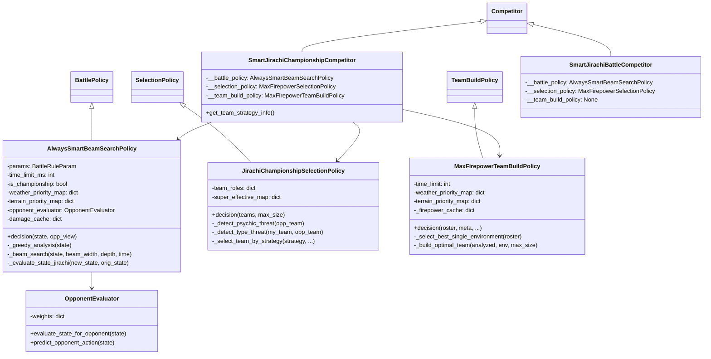
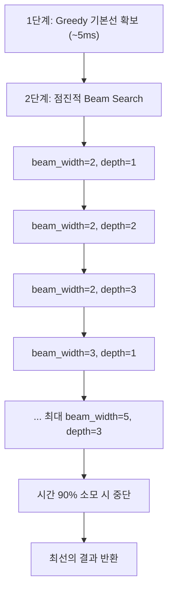
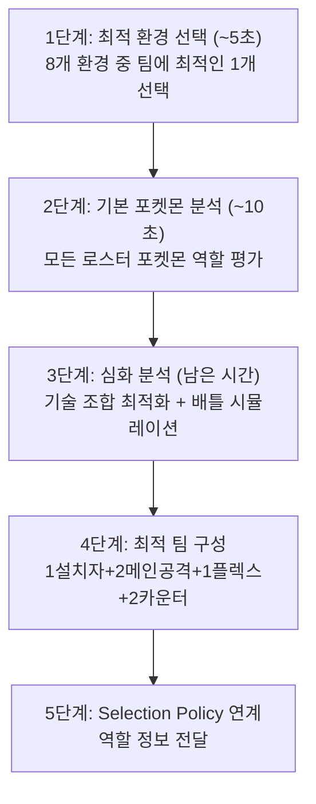
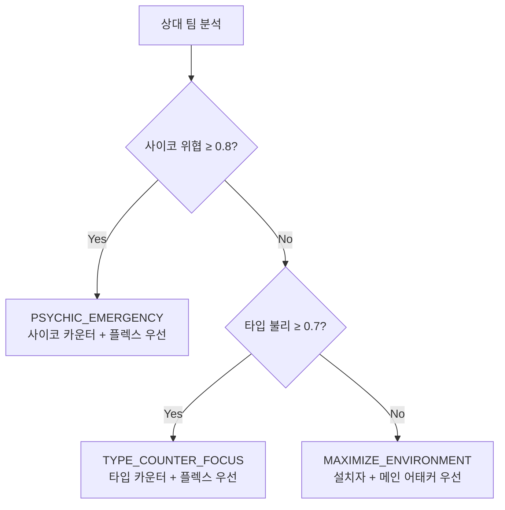

# 🔍 jirachi (DONGMIN KIM) 분석 보고서

> **제출자:** DONGMIN KIM  
> **분석일:** 2026-05-14  
> **파일 수:** 6개 (Python 4 + README + main)  
> **총 코드량:** ~2,560줄 (대회 최대) — core_policies 1,470줄 + team_builder 1,093줄  
> **특징:** **Beam Search** + **Max Firepower 전략** + **8개 환경 완전 지원** + **이중 평가 시스템**

---

## 1. 코드 구조 개요

```
jirachi - DONGMIN KIM/
├── main.py                              # 진입점 (Championship 모드)
├── jirachi_championship_competitor.py   # Championship Track 경쟁자 (224줄)
├── jirachi_battle_competitor.py         # Battle Track 경쟁자 (152줄)
├── jirachi_core_policies.py             # ⭐ 핵심: Beam Search + Selection (1,470줄)
├── jirachi_team_builder.py              # ⭐ 팀빌더: Max Firepower (1,093줄)
└── README.md                            # 상세 설명 문서 (134줄)
```

### 클래스 다이어그램



---

## 2. 핵심 전략: "Max Firepower" 철학

README에 명시된 4대 원칙:

| 원칙 | 설명 |
|---|---|
| **1턴킬 > 모든 것** | 상대를 즉시 처치 가능하면 최우선 |
| **스피드 = 생명** | 선공권 확보가 승리의 열쇠 |
| **고위험 고보상** | 확률 낮아도 고위력 기술 선호 |
| **환경 마스터** | 날씨+지형 8개 환경 완전 활용 |

---

## 3. 배틀 정책: Always Smart Beam Search

### 3.1 Beam Search란?

MCTS와 다른 트리 탐색 알고리즘. 각 깊이에서 **상위 N개 후보만** 유지하며 탐색 — 폭을 제한하여 효율적.

### 3.2 점진적 확장 전략



- **시간 제한:** 90ms (Championship) — 90% 소모 시 자동 중단
- **Greedy 안전망:** 탐색 실패 시에도 5ms 내 확보한 기본 결과 보장
- **점진적 확장:** 작은 beam부터 시작하여 시간이 허용하는 만큼 확대

### 3.3 행동 결정 우선순위

#### Championship 1턴차 (설치자)
```
1순위: 환경 설치 (날씨/지형)
2순위: 즉시 킬
3순위: 최선 공격
```

#### Championship 1턴차 (공격자)
```
1순위: 즉시 킬
2순위: 최선 공격
```

#### Battle Track / 일반 턴
```
1순위: 즉시 킬 (confidence ≥ 0.9)
2순위: 고가치 날씨 설치 (synergy > 600)
3순위: 고가치 지형 설치 (synergy > 400)
4순위: 최선 공격
```

### 3.4 상대 행동 예측 (`OpponentEvaluator`)

```python
# 상대 관점에서 최적 행동 예측
for move in opp_moves:
    score = damage
    if damage >= target.hp and accuracy >= 0.9:
        score *= 5.0   # 안전한 킬
    elif damage >= target.hp * 0.7 and accuracy >= 0.85:
        score *= 2.0   # 안정적 큰 데미지
    if accuracy < 0.8:
        score *= 0.5   # 불안정 기술 페널티
```

> **이중 평가:** 내 관점(화력) + 상대 관점(안전성)을 모두 고려

### 3.5 상태 평가 (`_evaluate_state_jirachi`)

```
score = (my_hp_ratio - opp_hp_ratio) × 100
      + (KO 수) × 1000
      + (환경 설치 성공 시) +300 (날씨) / +200 (지형)
```

### 3.6 환경 부스트 계산

```python
boost = 1.0
if move_type in weather_boosted_types:  boost *= 1.5
if move_type in terrain_boosted_types:  boost *= 1.3
# 최대: 1.5 × 1.3 = 1.95 (날씨+지형 동시)
```

---

## 4. 팀빌드 정책: Max Firepower Team Build

### 4.1 5단계 파이프라인



### 4.2 팀 구성 (6명)

| 슬롯 | 역할 | 수 | 설명 |
|---|---|---|---|
| 1 | **MAIN_SETTER** | 1명 | 최고속 환경 설치자 |
| 2-3 | **MAIN_ATTACKER** | 2명 | 환경 부스트 받는 어태커 |
| 4 | **FLEX_ATTACKER** | 1명 | 환경 독립 어태커 (타입 다양성) |
| 5 | **PSYCHIC_COUNTER** | 1명 | 에스퍼/사이코필드 카운터 (악/고스트/벌레) |
| 6 | **TYPE_COUNTER** | 1명 | 환경과 다른 타입의 카운터 |

### 4.3 환경 선택 알고리즘

8개 환경 (날씨 4 + 지형 4)에 대해:
```
환경 점수 = 설치자 보유 시 +300
          + 어태커 수 × 150
          + 총 화력 / 5
```
→ 가장 높은 점수의 **단일 환경**을 선택하여 팀 전체를 최적화

### 4.4 역할별 EV/Nature 배분

| 역할 | Nature | EV | 의도 |
|---|---|---|---|
| MAIN_SETTER | TIMID (스피드↑) | HP 252 / 스피드 252 | 빠른 설치 + 생존 |
| 물리 공격자 | JOLLY (스피드↑) | 공격 252 / 스피드 252 | 물리 화력 + 선공 |
| 특수 공격자 | TIMID (스피드↑) | 특공 252 / 스피드 252 | 특수 화력 + 선공 |

> **주목:** 모든 역할에서 **스피드 252 고정** — "스피드 = 생명" 철학 일관

### 4.5 기술 선택 스코어링

역할별 차별화된 기술 평가:

| 역할 | 최우선 기술 | 특별 보너스 |
|---|---|---|
| MAIN_SETTER | 환경 설치 기술 (+2000) | 선제기 (+400) |
| MAIN_ATTACKER | 고위력 기술 (+500) | 선제기 (+600), STAB (×1.5) |
| PSYCHIC_COUNTER | 악/고스트/벌레 기술 (×4) | 카운터 선제기 (+500) |
| TYPE_COUNTER | 다용도 타입 (+200) | 고위력 (+250) |

---

## 5. 선택 정책: 3가지 전략 분기

### Championship 선택 (`JirachiChampionshipSelectionPolicy`)



| 전략 | 조건 | 선택 우선순위 |
|---|---|---|
| PSYCHIC_EMERGENCY | 에스퍼 위협 ≥ 0.8 | 사이코카운터 → 플렉스 → 최강어태커 → 설치자 |
| TYPE_COUNTER_FOCUS | 타입 불리 ≥ 0.7 | 타입카운터 → 플렉스 → 메인어태커 → 설치자 |
| MAXIMIZE_ENVIRONMENT | 기본 | 설치자 → 메인어태커 → 플렉스 → 카운터 |

---

## 6. 전략 종합 평가

### 6.1 전체 전략 요약

| 단계 | 전략 | 수준 |
|---|---|---|
| **팀 빌드** | 환경 최적화 + 5역할 배분 + 기술 조합 탐색 | ✅✅ 최고 수준 |
| **선택** | 위협 분석 → 3가지 전략 분기 | ✅ 고급 |
| **배틀** | Beam Search + 이중 평가 + 환경 부스트 | ✅✅ 매우 고급 |

### 6.2 장점

| 장점 | 설명 |
|---|---|
| **압도적 코드량** | ~2,560줄 — 가장 많은 로직과 세부 구현 |
| **Beam Search** | 점진적 확장으로 시간 내 최적 해 탐색 |
| **환경 마스터** | 날씨 4개 + 지형 4개 = 8개 환경 완전 지원 |
| **팀빌더-선택 연계** | 팀빌더의 역할 정보를 선택 정책에 전달하는 통합 시스템 |
| **이중 평가** | 내 관점(화력) + 상대 관점(안전성) 종합 |
| **역할별 기술 최적화** | 역할에 따라 기술 스코어링이 완전히 다름 |
| **시간 예산 관리** | 팀빌드 60초, 배틀 90ms 모두 세밀한 시간 관리 |
| **캐싱 시스템** | 데미지, 화력, 포켓몬 분석 결과 캐싱 |
| **2트랙 지원** | Battle Track / Championship Track 별도 최적화 |
| **방어적 코딩** | 모든 함수에 try-except, hasattr 체크 |

### 6.3 약점

| 약점 | 심각도 | 설명 |
|---|---|---|
| 교체 전략 부재 | 🟡 중간 | 배틀 중 자발적 교체 로직 없음 |
| Nature 선택 제한 | 🟠 낮음 | JOLLY/TIMID만 사용 — 화력 Nature(ADAMANT/MODEST) 미사용 |
| `_get_pokemon_firepower` 더미 | 🟠 낮음 | `1000 - pokemon_idx * 10` — 실제 화력 미반영 |
| 과도한 print 출력 | 🟠 낮음 | 이모지 포함 대량 디버그 출력 — 대회 성능 영향 가능 |
| Beam Search 깊이 제한 | 🟡 중간 | 최대 depth=3, beam=5 — MCTS 대비 제한적 |
| `terrain_start` vs `field_start` | 🟡 중간 | 팀빌더에서 `terrain_start`, 배틀에서 `field_start` 사용 — 불일치 가능 |

---

## 7. 이전 제출물과 비교

| 비교 항목 | Botzilla | Caaaden | evoTrainer | iceMonte | **jirachi** |
|---|---|---|---|---|---|
| **접근법** | Q-Learning | 휴리스틱 | 규칙+EA | MCTS | **Beam Search** |
| **코드량** | ~300줄 | 326줄 | ~550줄 | ~680줄 | **~2,560줄** |
| **팀빌드** | 스탯 기반 | 역할별 | ❌ 없음 | 역할+조합탐색 | **환경+5역할+기술조합** |
| **선택** | 타입 다양성 | 카운터픽 | 단순 순서 | 조합 전수탐색 | **3전략 분기** |
| **배틀** | Greedy 폴백 | 데미지+KO | 유전자 규칙 | MCTS (95ms) | **Beam Search (90ms)** |
| **환경 활용** | 없음 | 없음 | 없음 | 없음 | **✅ 8개 완전** |
| **교체 전략** | 없음 | 기절 시 | 불리 매치업 | 상태이상/저HP | 없음 |
| **시간 관리** | 없음 | 없음 | 없음 | ✅ 95ms | **✅ 90ms 점진적** |

---

## 8. 결론

jirachi(DONGMIN KIM)는 대회 참가자 중 **가장 방대하고 체계적인 코드**를 제출했습니다. "Max Firepower" 철학 아래 팀빌드부터 배틀까지 **화력 극대화**라는 일관된 전략을 관철하며, 특히 **8개 환경(날씨+지형) 완전 지원**은 다른 어떤 제출물에도 없는 고유한 강점입니다.

Beam Search는 iceMonte의 MCTS와 비교할 때 탐색 깊이는 얕지만(3턴 vs 4~8턴), 점진적 확장과 시간 예산 관리로 **일관된 품질**을 보장합니다. 팀빌더의 5역할 시스템(설치자/메인어태커/플렉스/사이코카운터/타입카운터)과 선택 정책의 3전략 분기는 **도메인 지식이 가장 깊게 반영**된 부분입니다.

약점으로는 교체 전략의 부재와, JOLLY/TIMID Nature만 사용하여 정작 "화력 극대화" 철학에 맞는 ADAMANT/MODEST를 놓친 점이 있습니다.

**한 줄 요약:** 가장 방대한 코드와 깊은 도메인 지식, 환경 활용의 독보적 강자. 다만 "화력 극대화"에 올인하여 교체/방어적 플레이가 약하다.
