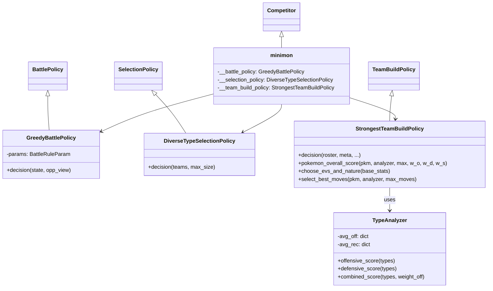
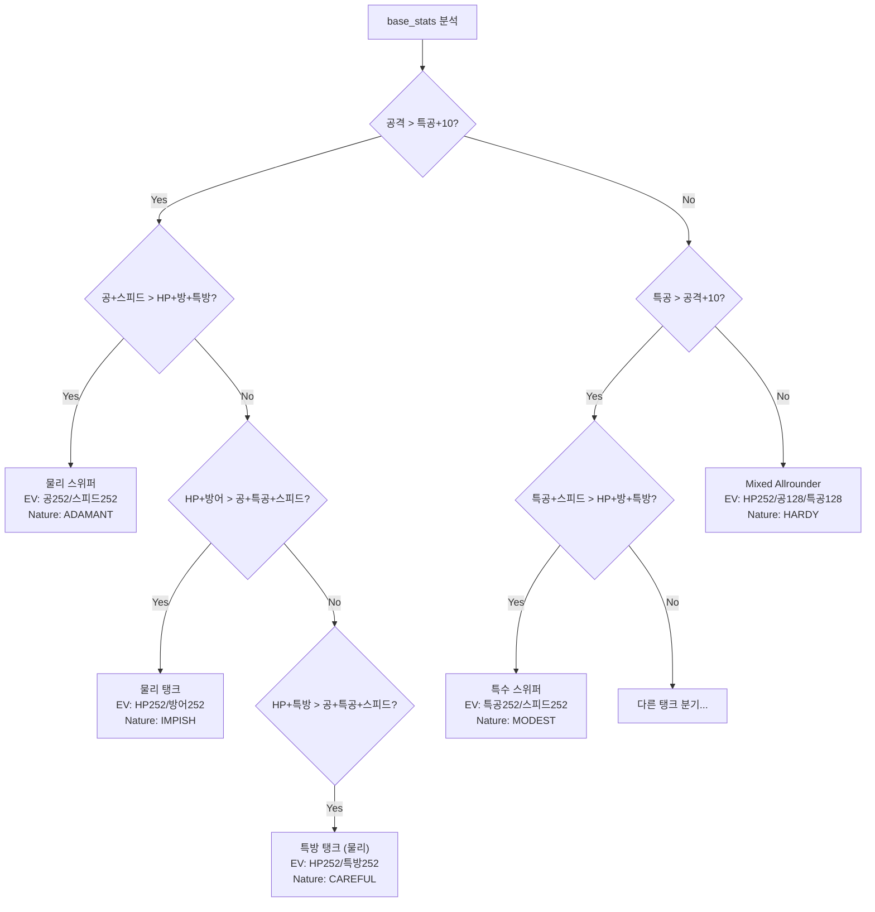

# 🔍 minimon_02 (Leon Brunke) 분석 보고서

> **제출자:** Leon Brunke  
> **분석일:** 2026-05-14  
> **파일 수:** 5개 Python 파일  
> **총 코드량:** ~410줄  
> **특징:** **타입 평균 공방 점수(TypeAnalyzer)** + **KO 최우선 더블배틀 전수 탐색** + **7가지 역할별 EV/Nature**

---

## 1. 코드 구조 개요

```
minimon_02 - Leon Brunke/
├── main.py                       # 진입점 (서버 연결)
├── minimon.py                    # Competitor 클래스 (정책 조립)
├── minimonBattlePolicy.py        # ⭐ 배틀 (전수 탐색 + KO 우선, 103줄)
├── minimonSelectionPolicy.py     # 선택 (타입 다양성, 43줄)
└── minimonTeambuildPolicy.py     # ⭐ 팀빌드 (TypeAnalyzer + 역할 판별, 211줄)
```

### 클래스 다이어그램



---

## 2. 배틀 정책 (`GreedyBattlePolicy`)

### 2.1 데미지 계산 (`expected_damage`)

엔진의 `calculate_damage` 함수를 사용하면서 **상태이상 보너스**를 추가:

```python
expected_damage = calculate_damage(...) × acc_factor + status_bonus
```

**상태이상 보너스 테이블:**

| 상태이상 | 보너스 점수 | 확률 반영 |
|---|---|---|
| BURN | 20 | × effect_prob |
| PARALYZED | 20 | × effect_prob |
| SLEEP | 20 | × effect_prob |
| POISON | 18 | × effect_prob |
| TOXIC | 18 | × effect_prob |
| FROZEN | 20 | × effect_prob |

> **주목:** 상태이상이 없는 적에게만 보너스 적용 — 이미 상태이상인 적에게는 순수 데미지만 고려

### 2.2 명중률 하드코딩 문제

```python
acc_factor = move.constants.accuracy / 100  # 명중률 계산
acc_factor = 1  # ← 바로 다음 줄에서 1로 덮어씀!
```

> **⚠️ 명중률 무시:** 명중률을 계산하는 코드가 있지만 바로 다음 줄에서 `1`로 덮어쓰여 **모든 기술이 100% 적중으로 계산**됨. 개발 중 디버깅 후 원래 코드로 복원하지 않은 것으로 추정.

### 2.3 싱글 배틀 결정

```python
outcomes = [expected_damage(move, ...) for move in battling_moves]
return argmax(outcomes)  # 가장 높은 기대 데미지 기술 선택
```

### 2.4 더블 배틀 결정 ⭐ (전수 탐색)

```python
for sources in product(모든 기술 조합):
    for targets in product(모든 타겟 조합):
        # 데미지 시뮬레이션 (HP 차감 반영)
        ko = 처치 수
        damage = 총 데미지
        strategies.append((ko, damage, sources, targets))
```

**전략 점수 공식:**
```
score = 1000 × ko + damage + 2 × len(set(targets))
```

| 요소 | 가중치 | 의미 |
|---|---|---|
| KO 수 | ×1000 | **처치가 압도적 최우선** |
| 총 데미지 | ×1 | KO 불가 시 최대 데미지 |
| 타겟 다양성 | ×2 | 같은 적만 공격하는 것 방지 (작은 보너스) |

**핵심 특징:**
- **모든 기술×타겟 조합을 전수 탐색** — 최적의 행동 보장
- HP 차감을 **시뮬레이션**하여 한 적에 두 포켓몬이 공격할 때 **오버킬 낭비 감지**
- KO 가능하면 한 적 집중, 불가능하면 **타겟 분산** (diversity_bonus)

> **JJJ(Focus Fire)와의 차이:** JJJ는 항상 같은 적을 집중하지만, minimon은 KO 불가 시 타겟을 **분산**

---

## 3. 선택 정책 (`DiverseTypeSelectionPolicy`)

### 타입 다양성 기반 선택

```python
for 각 포켓몬:
    type_combo = 해당 포켓몬의 타입 조합 (정렬)
    if type_combo가 이미 선택된 것과 겹치지 않으면:
        선택
# 부족하면 나머지에서 채움
```

- **같은 타입 조합의 포켓몬 중복 방지** — 타입 다양성 확보
- `species.types`의 값을 정렬하여 비교 → `(물/비행)`과 `(비행/물)`을 같게 처리

---

## 4. 팀빌드 정책 (`StrongestTeamBuildPolicy`)

### 4.1 TypeAnalyzer: 타입별 평균 상성 점수

**사전 계산된 타입별 공격/방어 효율:**

| 타입 | 공격 효율 (`avg_off`) | 방어 취약도 (`avg_rec`) |
|---|---|---|
| FIGHTING | **1.237** (최고 공격) | 1.132 (높은 취약도) |
| ROCK | 1.158 | 1.053 |
| GROUND | 1.132 | 1.026 |
| FIRE | 1.105 | 1.000 |
| DARK | 1.079 | 1.026 |
| DRAGON | 1.053 | 1.053 |
| FAIRY | 1.053 | 1.000 |
| STEEL | 0.895 (낮은 공격) | **0.895** (최저 취약도 = 최고 방어) |
| POISON | **0.816** (최저 공격) | 0.921 |

> **핵심:** 전체 18개 타입에 대한 평균 상성 배율을 미리 계산해둠. 특정 타입이 "전반적으로 공격에 유리한가?"를 수치화.

### 4.2 포켓몬 종합 점수

```
overall_score = 0.1 × offensive_type + 0.2 × defensive_type + 0.7 × stats_ratio
```

| 요소 | 가중치 | 계산 |
|---|---|---|
| **스탯 합계** | **70%** | `sum(base_stats) / MAX_STATS_SUM` |
| 방어 타입 점수 | 20% | `1 - avg_rec(types)` (낮을수록 좋음) |
| 공격 타입 점수 | 10% | `avg_off(types)` |

> **"스탯이 왕":** 스탯 합계가 70%를 차지 — 높은 종족값을 가진 포켓몬을 최우선

### 4.3 EV/Nature: 7가지 역할 판별

스탯 비교로 포켓몬의 역할을 자동 판별:



**전체 7가지 역할:**

| 역할 | 조건 | Nature | EV |
|---|---|---|---|
| 물리 스위퍼 | 공격 > 특공+10, 공격형 스탯 우세 | ADAMANT | 공252 / 스피드252 |
| 특수 스위퍼 | 특공 > 공격+10, 특수형 스탯 우세 | MODEST | 특공252 / 스피드252 |
| 물리 탱크 (물리형) | 공격 > 특공+10, 방어형 스탯 우세 | IMPISH | HP252 / 방어252 |
| 물리 탱크 (범용) | 방어형 스탯 우세 | BOLD | HP252 / 방어252 |
| 특방 탱크 (물리형) | 공격 > 특공+10, 특방형 우세 | CAREFUL | HP252 / 특방252 |
| 특방 탱크 (범용) | 특방형 우세 | CALM | HP252 / 특방252 |
| Mixed Allrounder | 그 외 | HARDY | HP252 / 공128 / 특공128 |

> **대회 참가자 중 가장 세밀한 역할 판별** — 7가지 분기로 스탯에 맞는 최적 Nature/EV 배분

### 4.4 기술 선택: 미사용 코드

```python
# moves = self.select_best_moves(p, analyzer, max_pkm_moves)  ← 주석 처리됨
moves = list(choice(n_moves, min(max_pkm_moves, n_moves), False))  # 랜덤 사용
```

> **⚠️ 좋은 기술 선택 로직이 있지만 주석 처리:** `select_best_moves`는 STAB 보너스와 타입 다양성을 고려하여 최적 기술을 선택하는 우수한 함수이지만, **실제로는 호출되지 않고 랜덤 선택이 사용됨.**

### 4.5 미사용 기술 선택 로직 (`select_best_moves`)

```python
# 1. 공격 기술만 필터링 (base_power > 0)
# 2. STAB × 타입 공격 점수 기준 정렬
# 3. 같은 타입 기술 중복 방지 (타입 다양성)
# 4. 최대 max_moves개 선택
```

> 구현은 완성되어 있으나 주석 처리로 활성화되지 않음 — 활성화하면 성능 향상 가능

---

## 5. 전략 종합 평가

### 5.1 전체 전략 요약

| 단계 | 전략 | 수준 |
|---|---|---|
| **팀 빌드** | TypeAnalyzer 점수 + **7역할 EV/Nature** (기술은 랜덤) | ✅ 체계적 |
| **선택** | 타입 다양성 기반 (중복 타입 방지) | ✅ 합리적 |
| **배틀** | **전수 탐색** + KO 최우선 + 타겟 다양성 보너스 | ✅ 우수 |

### 5.2 전략 철학

- **"강한 스탯 + 올바른 역할 배분":** 종족값이 높은 포켓몬을 골라, 스탯에 맞는 Nature/EV를 자동 배분
- **"KO가 왕":** 더블배틀에서 모든 기술×타겟 조합을 전수 탐색하여 KO를 최우선시
- TypeAnalyzer로 타입의 **전반적 공방 효율**을 정량화

### 5.3 장점

| 장점 | 설명 |
|---|---|
| **더블배틀 전수 탐색** | 모든 기술-타겟 조합을 시뮬레이션하여 최적 행동 보장 |
| **KO + 분산 균형** | KO 가능하면 집중, 불가능하면 타겟 분산 |
| **상태이상 보너스** | 데미지에 상태이상 가치를 합산하여 평가 |
| **7가지 역할 판별** | 스탯 기반 자동 역할 분류 → 최적 Nature/EV |
| **TypeAnalyzer** | 18개 타입의 평균 상성을 사전 계산하여 빠른 판단 |
| **타입 다양성 선택** | 같은 타입 조합의 포켓몬 중복 방지 |
| **HP 시뮬레이션** | 오버킬 낭비를 감지하여 효율적 공격 배분 |

### 5.4 약점

| 약점 | 심각도 | 설명 |
|---|---|---|
| 기술 랜덤 선택 | 🟡 중간 | `select_best_moves`가 주석 처리되어 랜덤 사용 |
| `acc_factor = 1` 하드코딩 | 🟠 낮음 | 명중률 계산 무시 — 개발 중 잔재 |
| 교체 전략 없음 | 🟡 중간 | 불리한 매치업에서도 교체하지 않음 |
| 상대팀 미분석 | 🟡 중간 | 선택 시 상대 팀 타입을 고려하지 않음 |
| 환경 미반영 | 🟠 낮음 | 날씨/지형 효과 미사용 |
| 스탯 합계 치중 | 🟠 낮음 | 70% 가중치 → 높은 종족값만 선호, 시너지 무시 |

---

## 6. 이전 제출물과 비교

| 비교 항목 | Botzilla | Caaaden | evoTrainer | iceMonte | jirachi | JJJ | LazeComp | **minimon** |
|---|---|---|---|---|---|---|---|---|
| **접근법** | Q-Learning | 휴리스틱 | 규칙+EA | MCTS | Beam Search | Focus Fire | 상태이상 | **전수탐색+역할** |
| **코드량** | ~300줄 | 326줄 | ~550줄 | ~680줄 | ~2,560줄 | ~420줄 | ~200줄 | **~410줄** |
| **팀빌드** | 스탯기반 | 역할별 | ❌ | 역할+조합 | 환경+5역할 | 랭크매트릭스 | 타입적합도 | **타입분석+7역할** |
| **EV** | - | 역할별 | ❌ | 역할별 | 스피드올인 | HP올인 | 랜덤 | **7역할 분기** |
| **Nature** | - | 역할별 | ❌ | 역할별 | JOLLY/TIMID | ADAMANT/MODEST | 랜덤 | **7가지 Nature** |
| **배틀** | Greedy폴백 | 데미지+KO | 유전자 | MCTS | Beam Search | Focus Fire | 상태이상→위력 | **전수탐색+KO** |
| **교체** | 없음 | 기절 시 | 불리매치 | 상태이상 | 없음 | 없음 | 없음 | **없음** |
| **독창성** | 중간 | 낮음 | 높음 | 높음 | 높음 | 높음 | 중간 | **중간** |

---

## 7. 결론

minimon_02(Leon Brunke)는 **체계적이고 균형 잡힌** AI를 구현한 제출물입니다. 더블배틀에서 **모든 기술×타겟 조합을 전수 탐색**하여 KO를 최우선시하면서도, 오버킬을 방지하고 타겟 분산까지 고려하는 점이 우수합니다. 팀빌드에서 **7가지 역할 판별**로 Nature/EV를 세밀하게 배분하는 것은 대회 참가자 중 가장 세밀합니다.

`TypeAnalyzer`의 사전 계산된 타입 효율 딕셔너리는 독창적인 접근이며, 독일어 주석(Kommentare)에서 알 수 있듯이 코드의 의도가 명확합니다.

가장 아쉬운 점은 잘 구현된 `select_best_moves` 함수가 **주석 처리되어 사용되지 않는 것**입니다. 이 함수를 활성화하면 기술 랜덤 선택이라는 약점이 해소되어 상당한 성능 향상이 기대됩니다.

**한 줄 요약:** 전수 탐색 배틀 + 7역할 EV/Nature + TypeAnalyzer로 균형 잡힌 구현. 기술 선택 로직을 주석 해제하면 더욱 강력해질 잠재력.
